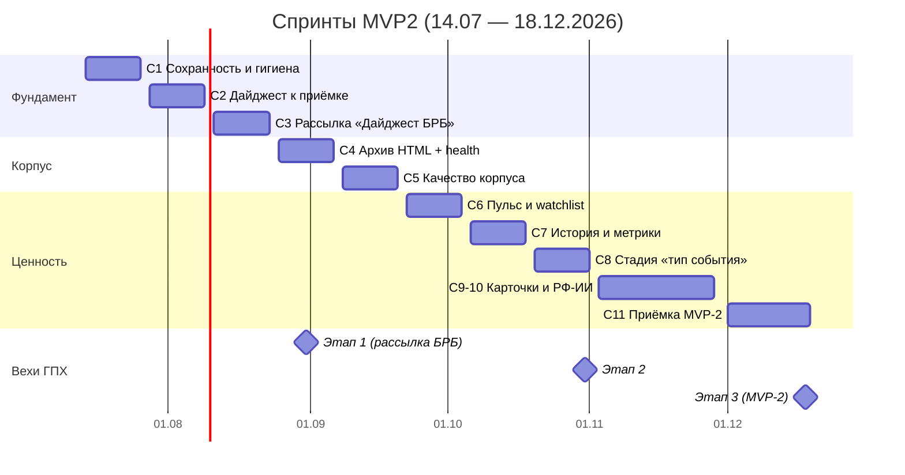
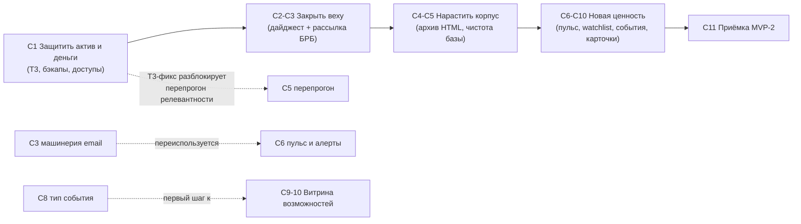

# 🗓 План спринтов MVP2 — «Нефтесервисный радар»

**Живой документ.** Здесь — блоки работ и спринты до 18.12.2026. План можно и нужно менять: правила — в разделе [«Как менять план»](#-как-менять-план).

| | |
|---|---|
| Горизонт | 14.07 — 18.12.2026 (11 спринтов по 2 недели) |
| Вехи (договор ГПХ) | **Этап 1 — 31.08** · **Этап 2 — 31.10** · **Этап 3 / MVP-2 — 18.12** |
| Рамка | Презентация ГД «Нефтесервисный радар» (июль 2026): рассылка «Дайджест БРБ», база знаний, качество источников; далее — «Витрина возможностей», «Витрина вызовов», отечественные ИИ |
| Команда | Михаил (продукт/бэкенд) + Герман (fullstack) |
| Обновлено | 2026-07-09 |

---

## 📐 Как менять план

1. **Пожелания заказчика** по-прежнему попадают в [BACKLOG.md](../BACKLOG.md) (раздел «Входящие»). Оттуда на границе спринта задача переносится сюда — в текущий/будущий спринт или в [Пул кандидатов](#-пул-кандидатов-вне-спринтов).
2. **Добавить задачу:** строка в таблицу нужного спринта со следующим свободным номером (`С3-4`, `С3-5`, …). Задачи из пула — переносом строки.
3. **Менять состав текущего спринта** можно только заменой (что-то добавили — что-то ушло в пул): спринт = фиксированный объём. Будущие спринты меняются свободно.
4. **Перепланирование** — на границах спринтов, не внутри. Если ресурса мало — режем целыми спринтами (сдвигаем хвост), а не крошим задачи.
5. **Статусы** как в BACKLOG: 🆕 план · 🔵 в работе · ✅ готово · ⏸ отложено · ❌ снято.
6. **Definition of Done:** код в `main` + тесты зелёные + задеплоено на прод + строка здесь и в BACKLOG.md обновлена. Не «написано», а «работает у заказчика».
7. В каждом спринте держим **буфер ~30%** на внеплановые правки заказчика — они приходят всегда.
8. Существенные изменения фиксируем в [Журнале изменений плана](#-журнал-изменений-плана). История правок — в git.

---

## 🗺 Схема: дорожная карта и вехи

Логика последовательности и ключевые зависимости:

---

## 🧱 Блоки работ

Работа идёт **блоками**: один спринт = один основной блок = один демонстрируемый инкремент.

| Блок | Подблоки | Суть |
|---|---|---|
| **A. Пайплайн сбора** | A1 источники/стратегии · A2 health+алерты · A3 архив HTML · A4 платные подписки | стабильный сбор из 120+ источников, вечные снапшоты первоисточников |
| **B. AI-конвейер** | B1 экономика · B2 качество · B3 новые стадии · B4 РФ-LLM | дешевле, чище, умнее: цены по моделям, чистка nano-хвоста, «тип события», NER, GigaChat/YandexGPT |
| **C. Данные и корпус** | C1 сохранность · C2 история дайджестов · C3 watchlist | корпус — главный актив: бэкапы, запрет тихого удаления, архив выпусков, списки наблюдения |
| **D. Дайджест и доставка** | D1 выпуск · D2 email-рассылка · D3 недельный пульс · D4 подписки по темам | от «PDF раз в месяц» к регулярной доставке ценности |
| **E. Платформа/UI** | E1 экран AI-затрат · E2 UX-фиксы · E3 теги/скоринг | честные цифры и удобство ежедневной работы |
| **F. Инфра и качество** | F1 CI · F2 мониторинг · F3 деплой · F4 безопасность | падения видим сами, деплой не страшен, тесты гоняются автоматически |

---

## 🏃 Спринты

### С1 · 14–25.07 · «Сохранность и гигиена» (блоки C1, F4, B1)

**Цель:** защитить корпус и деньги. До конца спринта **не запускать** перепрогон релевантности — recheck на текущем коде удаляет статьи физически.
**Инкремент:** корпус защищён, бюджет не утекает, о падениях узнаём из Telegram, перепрогон разблокирован.

| # | Задача | Блок | Статус | Кто | Примечание |
|---|---|---|:---:|---|---|
| С1-1 | T3-фикс: `payload_json` в `external_worker_complete` (api.py:1001) + `result_json` в recheck-dry-show (cli.py:443) + mark-режим по умолчанию (purge только явно) | C1 | 🆕 | Михаил | 🔴 первым делом; разблокирует П.1 бэклога |
| С1-2 | Авто-бэкап БД: pg_dump по расписанию + ротация 7 дн/4 нед + алерт при сбое | C1 | 🆕 | Михаил | бэкапов нет вообще; offsite — отдельно (С4+) |
| С1-3 | Экономия: фильтр rejected в `get_articles_needing_summary` (repository.py:1578) | B1 | 🆕 | Михаил | однострочный; сейчас отклонённые жгут дорогой гейт каждые 6 ч |
| С1-4 | Доступы: `/api/process` и `/api/jobs/process` → admin-only (T7); закрыть открытую регистрацию (env-флаг); maintenance/branding → admin | F4 | 🆕 | Герман | сейчас любой аноним может жечь OpenAI-бюджет |
| С1-5 | T8: Secure-флаг cookie + редирект `:80` → https в Caddyfile | F4 | 🆕 | Герман | проверить, что внешний воркер ходит по домену |
| С1-6 | Алерты: uptime-мониторинг на `/api/health` + cron-скрипт `/api/readiness`+`docker ps` → Telegram | F2 | 🆕 | Михаил | инцидент NL-воркера узнали вручную |
| С1-7 | Фоном: CI на GitHub Actions (pytest+postgres, vitest, docker build) | F1 | 🆕 | Герман | 44 httpx-теста наконец будут гоняться; pypi блокирован только локально |
| С1-8 | Фоном: фикс порядка слоёв Dockerfile (COPY src после npm ci) | F3 | 🆕 | Герман | полчаса; ускоряет каждую пересборку на слабом сервере |

### С2 · 28.07–08.08 · «Дайджест к приёмке» (блоки D1, E1, E2)

**Цель:** выпуск дайджеста собирается без ручных костылей, экономика AI честная.
**Инкремент:** демо заказчику — финальный дайджест по высокоценным статьям + экран затрат.

| # | Задача | Блок | Статус | Кто | Примечание |
|---|---|---|:---:|---|---|
| С2-1 | Довести редизайн «как у Виктора» (v1 готов) | D1 | 🆕 | Михаил | бэклог №3 |
| С2-2 | Финальная выгрузка по самым высокоценным статьям | D1 | 🆕 | Михаил | P1 заказчика от 26.06 |
| С2-3 | Пере-парсить дайджест-статьи со сломанными «Читать далее» | D1/A1 | 🆕 | Михаил | код-фикс уже в main, нужен прод-прогон |
| С2-4 | Фикс тихой порчи драфта: смена фильтров выкидывает позиции из очереди и сохранения (DigestPage.tsx:249–259, 383–397) | E2 | 🆕 | Герман | самый рискованный UX-долг |
| С2-5 | T4: пер-модельная таблица цен в `cost_usd` + SQL-пересчёт истории | E1/B1 | 🆕 | Михаил | сейчас экран занижает 15–100× |
| С2-6 | Экран «AI-затраты» в React-админке (эндпоинты уже есть) | E1 | 🆕 | Герман | после С2-5, иначе будет врать как легаси |

### С3 · 11–22.08 · «Рассылка Дайджест БРБ» (блок D2) → **веха: Этап 1 ГПХ (31.08)**

**Цель:** обещание из презентации ГД — «запуск рассылки Дайджест БРБ».
**Инкремент:** дайджест приходит списку получателей БРБ письмом.

| # | Задача | Блок | Статус | Кто | Примечание |
|---|---|---|:---:|---|---|
| С3-1 | Проверка канала: исходящий SMTP с РФ-VPS (порт 25/465), SPF/DKIM для oiltech-digest.ru | D2 | 🆕 | Михаил | делать ПЕРВЫМ — если порт закрыт, нужен внешний SMTP-сервис |
| С3-2 | SMTP-клиент (stdlib smtplib) + конфиг SMTP_* | D2 | 🆕 | Михаил | рендер письма уже готов (`render_digest_email`) |
| С3-3 | Получатели: таблица digest_recipients + CRUD API + экран в админке | D2 | 🆕 | Герман | бэклог №5 заказчика |
| С3-4 | POST /api/digest-send/{month} (admin-only) + кнопка «Разослать» с подтверждением | D2 | 🆕 | Герман | |
| С3-5 | Запуск по реальному списку БРБ + приёмо-сдаточные материалы этапа 1 | D2 | 🆕 | Михаил | веха 31.08 |

### С4 · 25.08–05.09 · «Память рынка: архив» (блоки A3, A2)

**Инкремент:** у каждой новой статьи — вечный HTML-снапшот (прямой запрос Родионова от 01.07); здоровье источников видно без рук.

| # | Задача | Блок | Статус | Кто |
|---|---|---|:---:|---|
| С4-1 | Таблица снапшотов (article_id, fetched_at, html gzip, sha256) + захват в article_fetcher | A3 | 🆕 | Михаил |
| С4-2 | Захват HTML во внешнем пути (gzip+base64 в result-payload) и playwright-ветке | A3 | 🆕 | Михаил |
| С4-3 | Retention снапшотов отвязан от recheck-purge (архив не удаляется вместе со статьёй) | A3/C1 | 🆕 | Михаил |
| С4-4 | source-health в цикл планировщика + Telegram-алерт по деградации (по БД, не live-пробам) | A2 | 🆕 | Герман |
| С4-5 | Просмотр снапшота из карточки статьи (ссылка «архивная копия») | A3/E2 | 🆕 | Герман |

### С5 · 08–19.09 · «Качество корпуса» (блок B2, B1)

**Инкремент:** выборка чистая, конвейер вдвое дешевле. ⚠️ Только после С1-1 (T3).

| # | Задача | Блок | Статус | Кто |
|---|---|---|:---:|---|
| С5-1 | Перепрогон релевантности МЯГКИМ режимом (`--mark` → ручная проверка → purge/unmark) — П.1 бэклога | B2 | 🆕 | Михаил |
| С5-2 | T5: `enqueue-reprocess --model-like nano` + перепрогон nano-хвоста (~1000 статей) | B2 | 🆕 | Михаил |
| С5-3 | Гейт на gpt-5.4 вместо 5.5 (пилот на 50 статьях → решение) — минус 50% стоимости гейта | B1 | 🆕 | Михаил |
| С5-4 | Prompt-cache: статичный блок (теги/критерии) в начало промпта (порог 1024 ток.) | B1 | 🆕 | Михаил |

### С6 · 22.09–03.10 · «Пульс и watchlist» (блоки D3, D4, C3)

**Инкремент:** продукт живёт между месячными PDF — недельный пульс и персональные алерты («подписки по темам» из презентации).

| # | Задача | Блок | Статус | Кто |
|---|---|---|:---:|---|
| С6-1 | Недельный пульс: date-диапазон в build_digest_content + короткий шаблон + cron-рассылка | D3 | 🆕 | Михаил |
| С6-2 | Watchlist: таблицы + CRUD API + матчинг новых статей по ключам/тегам | C3 | 🆕 | Михаил |
| С6-3 | Экран «Мои списки» + email-алерт при совпадении | D4 | 🆕 | Герман |

### С7 · 06–17.10 · «История и метрики» (блоки C2, E3) → **веха: Этап 2 ГПХ (31.10)**

**Инкремент:** архив выпусков по годам/месяцам с метриками (№8 заказчика).

| # | Задача | Блок | Статус | Кто |
|---|---|---|:---:|---|
| С7-1 | GET /api/monthly-digests (листинг) + метрики выпуска (статьи, баллы, теги, источники) | C2 | 🆕 | Михаил |
| С7-2 | Экран «Архив дайджестов» по годам/месяцам | C2 | 🆕 | Герман |
| С7-3 | UX тегов/скоринга по конкретике заказчика (снять на демо С6) | E3 | 🆕 | Герман |

### С8 · 20–31.10 · «Стадия "тип события"» (блок B3)

**Инкремент:** дайджест и пульс группируют «5 сигналов: сделки / внедрения / санкции» — первый шаг к «Витрине возможностей».

| # | Задача | Блок | Статус | Кто |
|---|---|---|:---:|---|
| С8-1 | AI-стадия «тип события» (enum: контракт/M&A/внедрение/авария/санкции) по паттерну переводчика | B3 | 🆕 | Михаил |
| С8-2 | Разовый прогон по релевантным + фильтр по типу в UI и дайджесте | B3/E2 | 🆕 | оба |

### С9–С10 · 03–27.11 · «Карточки и РФ-ИИ» (блоки B3, B4)

**Инкремент:** прототип «Витрины возможностей» + отчёт по отечественным ИИ (обещания ГД).

| # | Задача | Блок | Статус | Кто |
|---|---|---|:---:|---|
| С9-1 | Досье-лайт: страница «компания/технология» = поисковая подборка + AI-резюме по кнопке (без тяжёлого NER) | B3 | 🆕 | оба |
| С9-2 | Если досье востребованы → NER-стадия + таблица article_entities | B3 | 🆕 | Михаил |
| С9-3 | РФ-LLM PoC: адаптер /chat/completions (GigaChat или YandexGPT) + сравнение качества гейта на 100 статьях | B4 | 🆕 | Михаил |

### С11 · 01–18.12 · «Приёмка MVP-2» → **веха: Этап 3 ГПХ (18.12)**

| # | Задача | Блок | Статус | Кто |
|---|---|---|:---:|---|
| С11-1 | Стабилизация и доводка по итогам демо С6–С10 | все | 🆕 | оба |
| С11-2 | Приёмо-сдаточные материалы MVP-2 | — | 🆕 | Михаил |
| С11-3 | Предложения по развитию 2027 (интеграция «Витрина вызовов») — п.5 решения ГД, срок 4 кв. | — | 🆕 | Михаил |

---

## 📦 Пул кандидатов (вне спринтов)

Задачи без спринта: берём отсюда при перепланировании, сюда же убираем вытесненное.

| Задача | Блок | Откуда | Почему не в спринте |
|---|---|---|---|
| Платные подписки ИнфоТЭК/НГВ (авторизация в фетчере: cookie/логин у источника) | A4 | Родионов 01.07 | сначала решение о подписках и право цитирования; техчасть — M |
| Playwright-тюнинг отложенных источников (Сбер, Росатом, WoodMac, Deloitte, Pet.Economist) | A1 | бэклог №9 | низкий ROI, по остаточному принципу |
| Hard-WAF источники (Cloudflare/Akamai: EnergyVoice, BCG, S&P) | A1 | память #15 | нужен challenge-solver — отдельный проект, ROI сомнителен |
| Rate-limit логина (защита от брутфорса / CPU-DoS) | F4 | аудит 09.07 | S; взять в любой спринт при простое |
| Деплой-скрипт со smoke-проверкой (deploy.sh: бэкап → reset → build → readiness) | F3 | аудит 09.07 | после CI (С1-7) |
| Registry/GHCR для образов (деплой без сборки на 1.9G сервере) | F3 | аудит 09.07 | проверить доступность ghcr с РФ-сервера |
| woff2-конвертация шрифтов GPN Din (~-60% веса) | E2 | аудит | S, косметика |
| Чистка dead-code hero-лендинга в App.tsx + удаление ветки backup-ui | E2 | аудит | S; ветки удалять только с согласия владельца |
| Продуктовый лендинг на поддомене | — | бэклог №8, P4 | ждёт решения |
| Кластеризация тем (упомянута в презентации, слайд 4) | B3 | презентация ГД | после стадии событий/NER — иначе не на чем кластеризовать |

---

## 📝 Журнал изменений плана

| Дата | Что изменили | Кто |
|---|---|---|
| 2026-07-09 | Первая версия плана (по аудиту кода, презентации ГД и бэклогу) | Михаил + Claude |
