# OilTech Digest: архитектура и процессы

## 1. Назначение

Система автоматически собирает статьи из заданных источников, выделяет суть, оценивает релевантность через настраиваемый AI-скоринг, присваивает тег и дает пользователю интерфейс для отбора материалов в месячный дайджест.

## 2. Основные модули

```text
Scheduler
  ├─ parser job: каждые 12 часов
  └─ export/publish job: каждый час

Parser
  ├─ RSS parser
  ├─ request/web parser для источников без RSS
  └─ Telegram parser позже

Processing pipeline
  ├─ нормализация статьи
  ├─ дедупликация
  ├─ AI-суть
  ├─ AI-скоринг
  ├─ AI-тегирование
  └─ сохранение карточки

Admin UI
  ├─ Все статьи
  ├─ Месячный дайджест
  ├─ Источники (включение, URL, тип RSS/request)
  ├─ Скоринг
  └─ Теги

Export
  ├─ PDF
  └─ DOCX
```

### 2.1 Общая схема

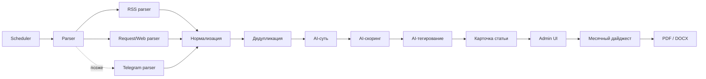

### 2.2 Границы модулей

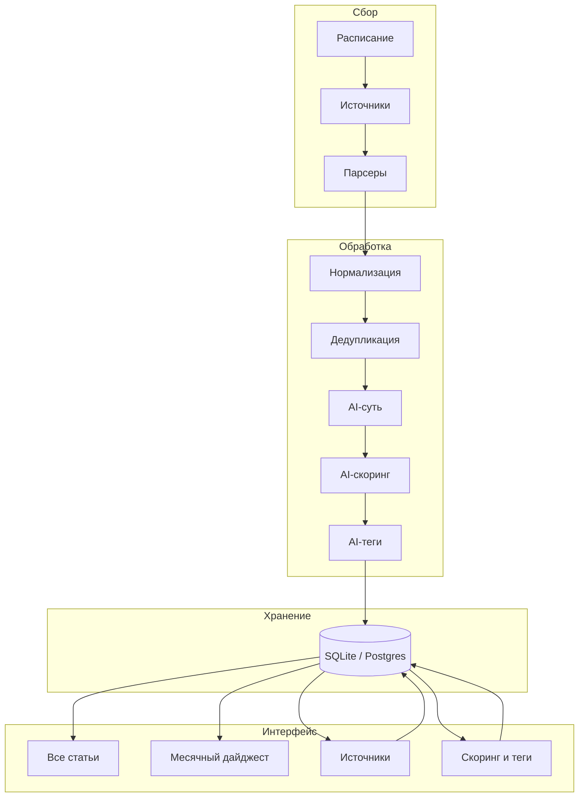

## 3. Процесс сбора статей

1. Scheduler запускает parser job раз в 12 часов.
2. Система берет все включенные источники.
3. Для источников с RSS используется RSS parser.
4. Для источников без RSS используется request/web parser.
5. Telegram-источники подключаются отдельным этапом после стабилизации основной логики.
6. Каждая найденная статья нормализуется:
   - заголовок;
   - ссылка;
   - источник;
   - дата публикации;
   - дата попадания в систему;
   - сырой текст или извлеченный фрагмент.
7. Выполняется дедупликация по URL и content hash.
8. Новые статьи передаются в processing pipeline.

### 3.1 Схема процесса сбора

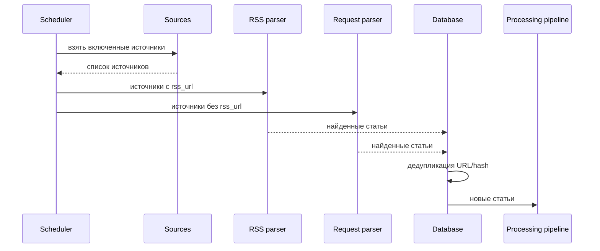

## 4. Processing pipeline

Для каждой новой статьи:

1. Сформировать `summary` через AI.
2. Рассчитать score по активным критериям.
3. Присвоить тег по иерархии тегов.
4. Создать или обновить карточку статьи.
5. Сделать статью доступной в разделе `Все статьи`.

### 4.1 Схема обработки статьи

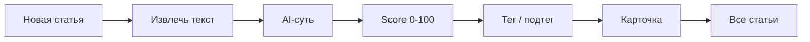

## 5. Скоринг

Пока используется один профиль скоринга.

Критерий скоринга содержит:

- название;
- вес;
- описание для AI;
- ключевые слова;
- автоматически нормализованные английские ключи.

Логика:

1. Пользователь задает критерии и веса.
2. Сумма весов должна быть ровно 100%.
3. Русские ключевые слова нормализуются в английские подсказки, чтобы работали на зарубежных источниках.
4. Keyword matching используется как быстрый сигнал.
5. AI оценивает статью по каждому критерию с учетом смысла, синонимов и контекста.
6. Итоговый score считается как взвешенная сумма оценок по критериям.
7. Score хранится как число от 0 до 100.

### 5.1 Формула

```text
criterion_final_score = f(keyword_score, ai_score)
total_score = Σ(criterion_final_score * criterion_weight) / 100
```

### 5.2 Схема скоринга

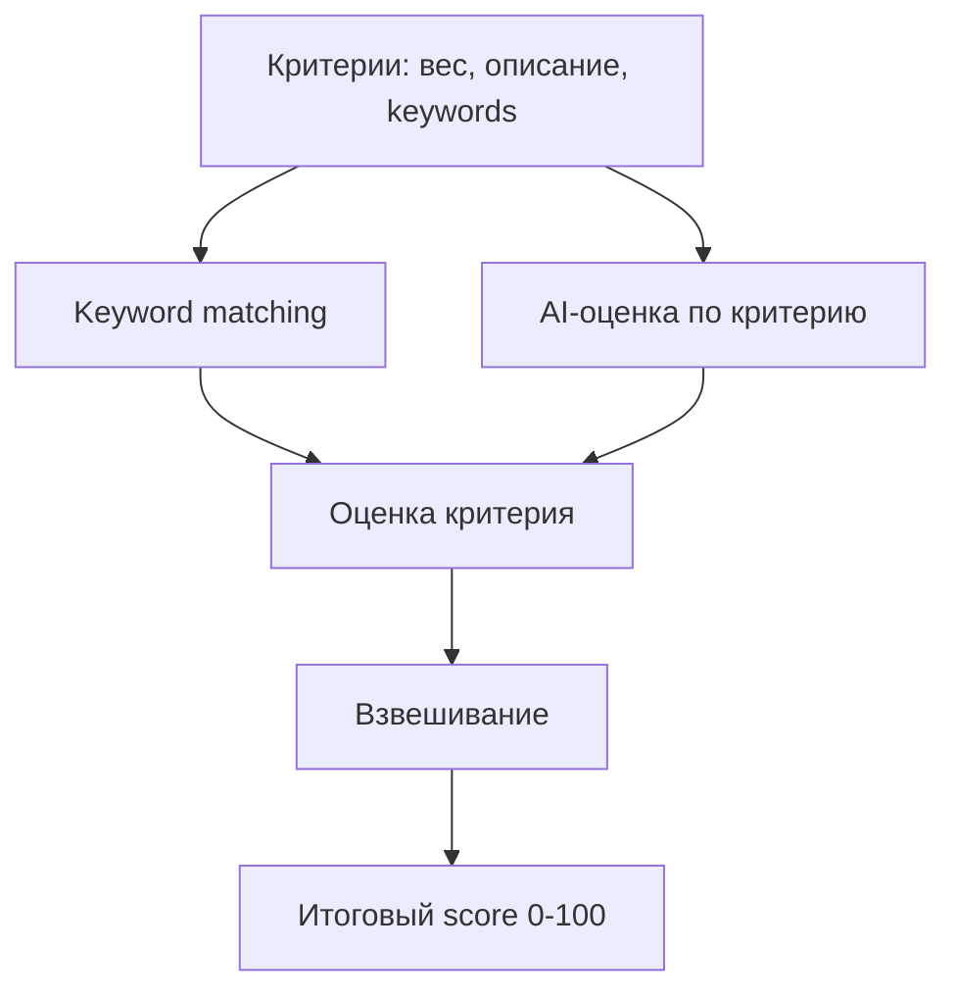

## 6. Тегирование

Теги имеют иерархию:

```text
ГРП
  ├─ Электро-ГРП
  └─ Материалы ГРП

Бурение
  ├─ Автономное бурение
  └─ Геонавигация
```

Тег содержит:

- родительский тег, если есть;
- название;
- описание для AI;
- ключевые слова;
- признак активности.

Логика:

1. AI выбирает наиболее подходящий тег.
2. Если подходит подтег, статье присваивается путь вида `ГРП / Электро-ГРП`.
3. Если подтег не определен, может быть выбран верхнеуровневый тег.
4. В интерфейсе статьи группируются по верхнеуровневому тегу.

### 6.1 Схема тегирования

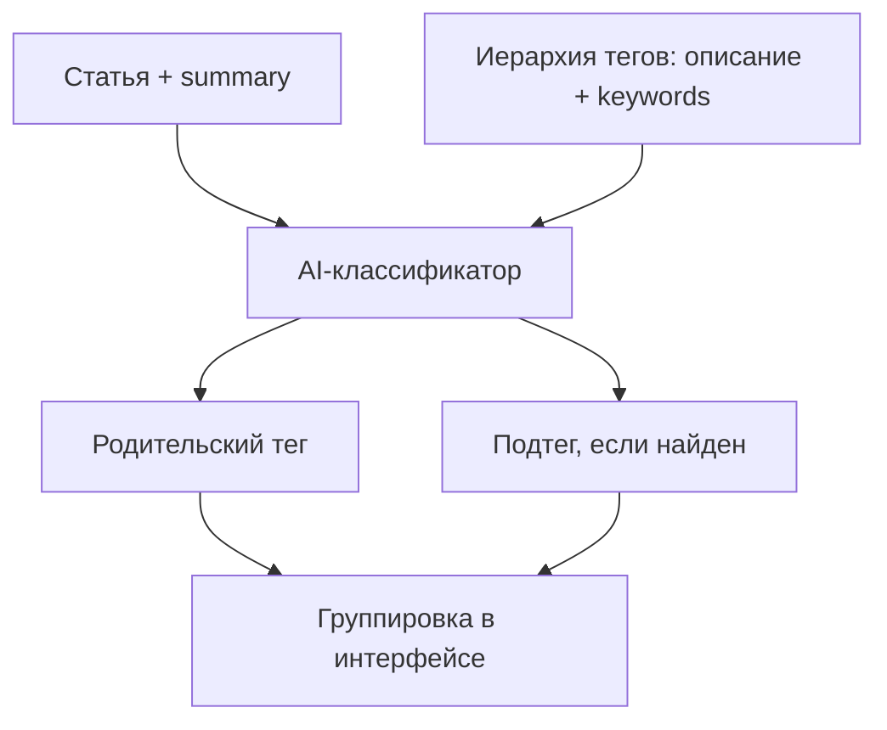

## 7. Интерфейс

### 7.1 Все статьи

Основное рабочее представление.

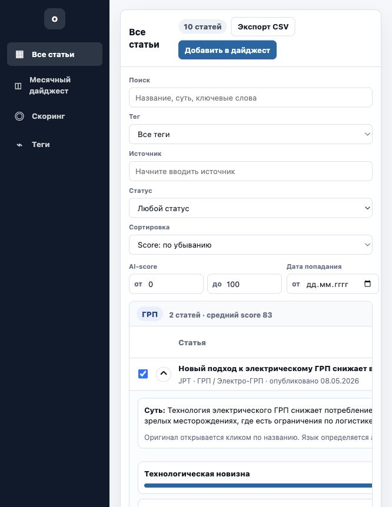

Статьи сгруппированы по верхнеуровневым тегам.

Строка статьи содержит:

- чекбокс выбора в дайджест;
- раскрытие строки;
- название статьи как ссылка на оригинал;
- источник;
- тег;
- дата публикации;
- дата попадания;
- AI-score;
- оценка;
- статус.

По раскрытию строки показывается:

- суть статьи;
- дополнительные метаданные;
- детализация AI-скоринга по критериям.

Фильтры:

- поиск по названию, сути и источнику;
- тег с иерархическим выбором;
- источник через searchable dropdown;
- статус;
- AI-score от/до;
- дата попадания от/до;
- сортировка по score или дате.

Если по фильтрам в группе нет статей, показывается только строка группы:

```text
ГРП · по текущим фильтрам пусто
```

Внутренние колонки и пустые строки не показываются.

#### Сценарий

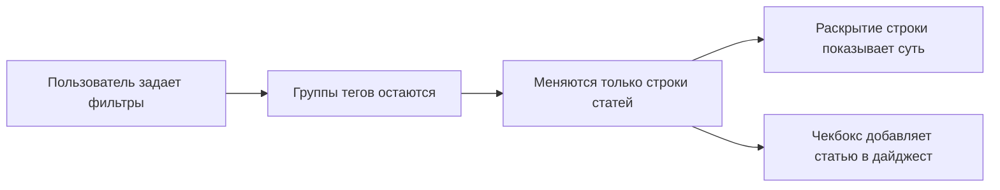

### 7.2 Месячный дайджест

Пока ручной режим.

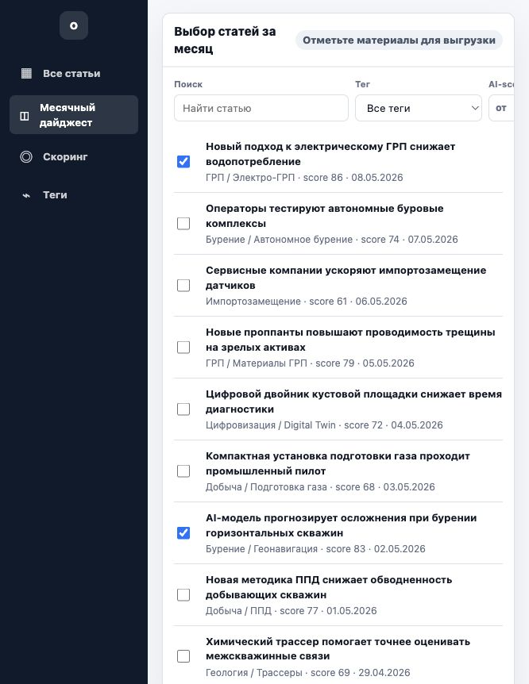

Пользователь:

1. Фильтрует статьи.
2. Отмечает нужные материалы.
3. Видит черновик дайджеста справа.
4. Нажимает `Скачать дайджест`.
5. Выбирает формат:
   - PDF;
   - DOCX.

#### Сценарий

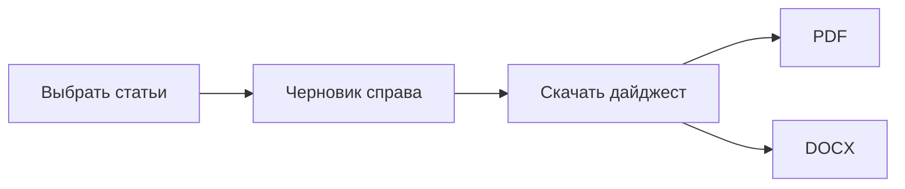

### 7.3 Скоринг

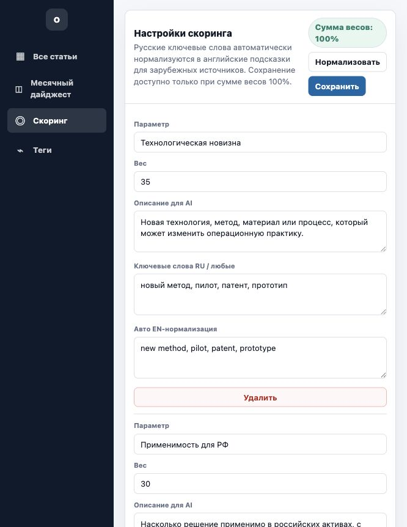

Пользователь может:

- добавлять критерии;
- удалять критерии;
- менять вес;
- менять описание для AI;
- менять ключевые слова;
- нормализовать веса до 100%;
- сохранить настройки только если сумма весов равна 100%.

### 7.4 Теги

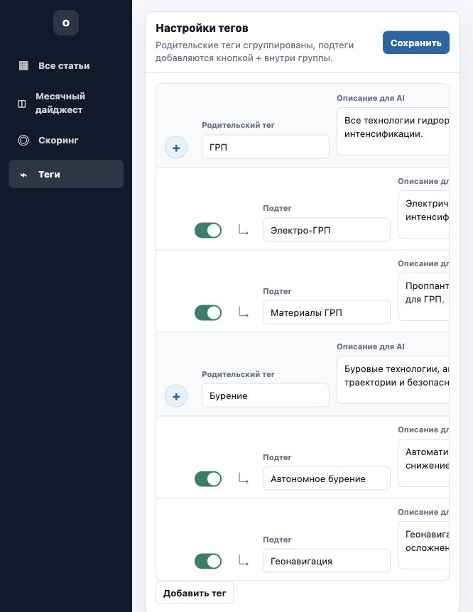

Пользователь может:

- добавить верхнеуровневый тег;
- добавить подтег через `+` у родительского тега;
- редактировать название;
- редактировать описание для AI;
- редактировать ключевые слова;
- включать или выключать тег;
- удалять тег.

### 7.5 Источники

Экран управления записями `sources`: поиск, фильтр по типу и признаку «включён», правка URL, массовое включение/отключение, проверка доступности (в продукте — реальный запрос к ленте или странице).

## 8. Расписание

```text
Каждые 12 часов:
  - сбор статей;
  - дедупликация;
  - summary;
  - scoring;
  - tagging;
  - обновление карточек.

Каждый час:
  - регулярная выгрузка/публикация по ранее заданной логике.
```

### 8.1 Схема расписания

```mermaid
gantt
  title Регулярные задачи
  dateFormat  HH:mm
  axisFormat  %H:%M
  section Parser
  Сбор и обработка статей :active, p1, 00:00, 1h
  Сбор и обработка статей :p2, 12:00, 1h
  section Export
  Почасовая выгрузка :e1, 00:00, 15m
  Почасовая выгрузка :e2, 01:00, 15m
  Почасовая выгрузка :e3, 02:00, 15m
```

## 9. Схема БД

### 9.0 ER-схема

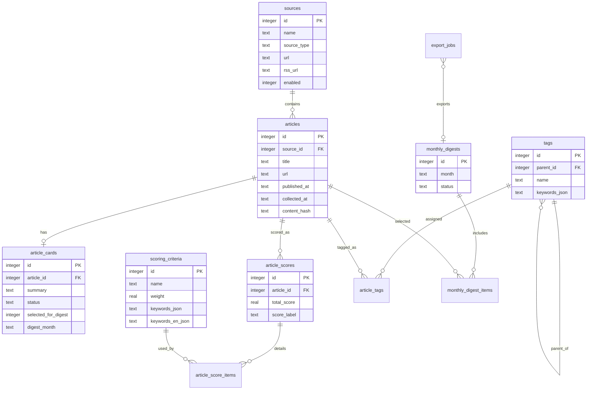

### 9.1 sources

Источники статей.

```sql
CREATE TABLE sources (
  id              INTEGER PRIMARY KEY,
  name            TEXT NOT NULL,
  source_type     TEXT NOT NULL, -- rss / web / telegram
  url             TEXT,
  rss_url         TEXT,
  enabled         INTEGER DEFAULT 1,
  parse_strategy  TEXT,          -- rss / request / telegram
  category        TEXT,
  priority        REAL DEFAULT 1.0,
  last_parsed_at  TEXT,
  created_at      TEXT,
  updated_at      TEXT
);
```

### 9.2 articles

Исходные статьи.

```sql
CREATE TABLE articles (
  id             INTEGER PRIMARY KEY,
  source_id      INTEGER NOT NULL,
  title          TEXT NOT NULL,
  url            TEXT NOT NULL,
  published_at   TEXT,
  collected_at   TEXT NOT NULL,
  raw_text       TEXT,
  language       TEXT,
  content_hash   TEXT,
  created_at     TEXT,
  updated_at     TEXT,
  FOREIGN KEY (source_id) REFERENCES sources(id)
);
```

### 9.3 article_cards

Рабочие карточки статей. В интерфейсе это строки в разделе `Все статьи`.

```sql
CREATE TABLE article_cards (
  id                   INTEGER PRIMARY KEY,
  article_id            INTEGER NOT NULL,
  summary               TEXT,
  status                TEXT DEFAULT 'new',
  selected_for_digest   INTEGER DEFAULT 0,
  digest_month          TEXT,
  analyst_comment       TEXT,
  created_at            TEXT,
  updated_at            TEXT,
  FOREIGN KEY (article_id) REFERENCES articles(id)
);
```

### 9.4 scoring_criteria

Критерии скоринга.

```sql
CREATE TABLE scoring_criteria (
  id                    INTEGER PRIMARY KEY,
  name                  TEXT NOT NULL,
  description           TEXT,
  weight                REAL NOT NULL,
  keywords_json         TEXT,
  keywords_en_json      TEXT,
  enabled               INTEGER DEFAULT 1,
  sort_order            INTEGER DEFAULT 0,
  created_at            TEXT,
  updated_at            TEXT
);
```

### 9.5 article_scores

Итоговый score статьи.

```sql
CREATE TABLE article_scores (
  id              INTEGER PRIMARY KEY,
  article_id       INTEGER NOT NULL,
  total_score      REAL NOT NULL,
  score_label      TEXT,
  explanation      TEXT,
  created_at       TEXT,
  updated_at       TEXT,
  FOREIGN KEY (article_id) REFERENCES articles(id)
);
```

### 9.6 article_score_items

Детализация score по критериям.

```sql
CREATE TABLE article_score_items (
  id                 INTEGER PRIMARY KEY,
  article_score_id    INTEGER NOT NULL,
  criterion_id        INTEGER NOT NULL,
  keyword_score       REAL,
  ai_score            REAL,
  final_score         REAL,
  rationale           TEXT,
  created_at          TEXT,
  FOREIGN KEY (article_score_id) REFERENCES article_scores(id),
  FOREIGN KEY (criterion_id) REFERENCES scoring_criteria(id)
);
```

### 9.7 tags

Иерархические теги.

```sql
CREATE TABLE tags (
  id                INTEGER PRIMARY KEY,
  parent_id         INTEGER,
  name              TEXT NOT NULL,
  description       TEXT,
  keywords_json     TEXT,
  enabled           INTEGER DEFAULT 1,
  sort_order        INTEGER DEFAULT 0,
  created_at        TEXT,
  updated_at        TEXT,
  FOREIGN KEY (parent_id) REFERENCES tags(id)
);
```

### 9.8 article_tags

Результат тегирования статьи.

```sql
CREATE TABLE article_tags (
  id            INTEGER PRIMARY KEY,
  article_id     INTEGER NOT NULL,
  tag_id         INTEGER NOT NULL,
  confidence     REAL,
  rationale      TEXT,
  created_at     TEXT,
  FOREIGN KEY (article_id) REFERENCES articles(id),
  FOREIGN KEY (tag_id) REFERENCES tags(id)
);
```

### 9.9 monthly_digests

Месячные дайджесты.

```sql
CREATE TABLE monthly_digests (
  id           INTEGER PRIMARY KEY,
  month        TEXT NOT NULL, -- YYYY-MM
  title        TEXT,
  status       TEXT DEFAULT 'draft',
  created_at   TEXT,
  updated_at   TEXT
);
```

### 9.10 monthly_digest_items

Статьи внутри месячного дайджеста.

```sql
CREATE TABLE monthly_digest_items (
  id             INTEGER PRIMARY KEY,
  digest_id       INTEGER NOT NULL,
  article_id      INTEGER NOT NULL,
  sort_order      INTEGER DEFAULT 0,
  section         TEXT,
  editor_note     TEXT,
  created_at      TEXT,
  FOREIGN KEY (digest_id) REFERENCES monthly_digests(id),
  FOREIGN KEY (article_id) REFERENCES articles(id)
);
```

### 9.11 export_jobs

История выгрузок.

```sql
CREATE TABLE export_jobs (
  id              INTEGER PRIMARY KEY,
  export_type      TEXT NOT NULL, -- hourly / monthly_digest
  format           TEXT,          -- pdf / docx / csv
  status           TEXT,
  file_path        TEXT,
  error_message    TEXT,
  started_at       TEXT,
  finished_at      TEXT
);
```

## 10. Статусы статьи

```text
new          новая
review       на проверке
digest       в дайджест
archive      архив
```

## 11. Минимальный MVP

1. Парсинг RSS раз в 12 часов.
2. Парсинг web/request источников раз в 12 часов.
3. Дедупликация по URL и content hash.
4. AI-суть статьи.
5. Настраиваемый скоринг.
6. Настраиваемые иерархические теги.
7. AI-тегирование.
8. Раздел `Все статьи` с группировкой по тегам.
9. Ручной выбор статей в месячный дайджест.
10. Выгрузка месячного дайджеста в PDF и DOCX.
