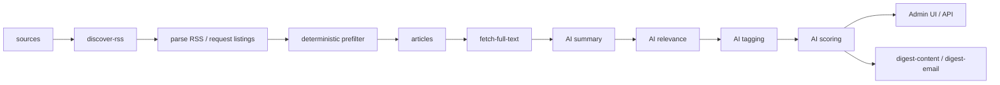
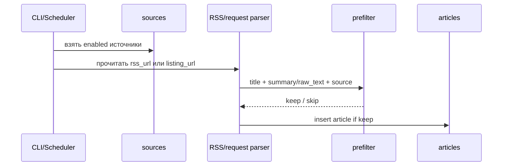
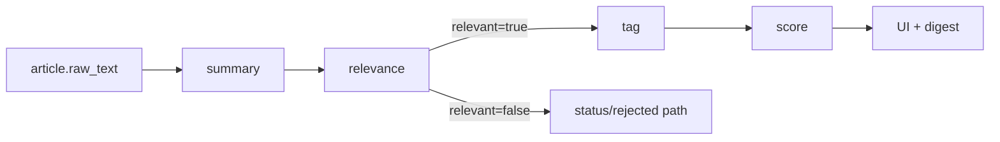

# OilTech Digest: архитектура

Этот документ описывает текущую архитектуру проекта в том виде, как она реально
работает сейчас в коде.

## 1. Архитектурный срез

Система состоит из четырех слоев:

1. `ingestion` — сбор источников и статей;
2. `storage` — PostgreSQL и SQL-репозиторий;
3. `processing` — AI-обработка и сбор дайджеста;
4. `delivery` — FastAPI API, Admin UI и Docker scheduler.

## 2. Общий поток



## 3. Компоненты

### 3.1 Ingestion

Файлы:

- [excel_seed.py](../oiltech_digest/ingestion/excel_seed.py)
- [rss_discovery.py](../oiltech_digest/ingestion/rss_discovery.py)
- [rss_parser.py](../oiltech_digest/ingestion/rss_parser.py)
- [request_parser.py](../oiltech_digest/ingestion/request_parser.py)
- [relevance_filter.py](../oiltech_digest/ingestion/relevance_filter.py)
- [article_fetcher.py](../oiltech_digest/ingestion/article_fetcher.py)
- [http_client.py](../oiltech_digest/ingestion/http_client.py)

Что делают:

- `seed-sources` грузит каталог источников из Excel в `sources`;
- `discover-rss` пытается найти RSS-ленту у источников и выставляет `rss_url` и `parse_strategy`;
- `parse` для `rss` читает ленты, а для `request` мониторит `listing_url`/`url`,
  вытаскивает ссылки на статьи, сравнивает их с уже известными `url` и сохраняет
  только новые материалы;
- `request_parser` ведет у источника `last_seen_article_url`,
  `last_seen_published_at` и `last_listing_hash`, чтобы мониторинг был инкрементальным;
- оба режима помечают обрезанный текст и отсекают явный нерелевантный шум;
- `fetch-full-text` идет в `article.url` и пытается заменить анонс на полный текст.

### 3.2 Storage

Файлы:

- [schema.sql](../oiltech_digest/db/schema.sql)
- [connection.py](../oiltech_digest/db/connection.py)
- [repository.py](../oiltech_digest/db/repository.py)

Роль слоя:

- хранит все источники, статьи, AI-результаты и настройки;
- дает узкие SQL-функции для CLI, API и processing pipeline;
- держит проект на PostgreSQL, без ORM.

### 3.3 Processing

Файлы:

- [pipeline.py](../oiltech_digest/processing/pipeline.py)
- [openai_client.py](../oiltech_digest/processing/openai_client.py)
- [prompts.py](../oiltech_digest/processing/prompts.py)
- [seed.py](../oiltech_digest/processing/seed.py)
- [digest.py](../oiltech_digest/processing/digest.py)

Текущий AI pipeline:

```text
summary -> relevance -> tag -> score
```

Логика:

1. `summary` пишет краткую суть статьи в `article_cards.summary`;
2. `relevance` помечает статью как релевантную или нет;
3. `tag` присваивает один тег из иерархии `tags`;
4. `score` считает итоговый score и детализацию по критериям;
5. каждый AI-вызов пишет метрики в `ai_processing_runs`.

### 3.4 Delivery

Файлы:

- [api.py](../oiltech_digest/api.py)
- [app.html](../web/app.html)
- [docker-scheduler.sh](../scripts/docker-scheduler.sh)
- [docker-compose.yml](../docker-compose.yml)

Что здесь происходит:

- FastAPI отдает API и статический UI;
- UI работает прямо с реальной БД через API;
- scheduler циклически запускает ingestion и AI.

## 4. Pipeline детальнее

### 4.1 Сбор статьи



### 4.2 Дозагрузка полного текста

Если в RSS пришел только тизер:

1. статья попадает в `articles` с `text_truncated = true`;
2. `fetch-full-text` идет по `url`;
3. если текст длиннее `min_chars`, он заменяет `raw_text`;
4. в `articles` фиксируются:
   - `full_text_fetched_at`
   - `full_text_status`
   - `full_text_error`
   - `extraction_method`

### 4.3 AI-обработка



Ключевая особенность:

- нерелевантные статьи не идут дальше в `tag` и `score`;
- это снижает шум в системе и экономит токены.

## 5. Модель хранения

### 5.1 Основные таблицы

- `sources` — каталог источников и состояние monitoring для non-RSS листингов;
- `articles` — сырые статьи;
- `article_cards` — summary, relevance, статус и ручные пометки;
- `tags` — иерархия тем;
- `article_tags` — итоговая классификация статьи;
- `scoring_criteria` — критерии скоринга;
- `article_scores` — итоговый score;
- `article_score_items` — детализация по критериям;
- `ai_processing_runs` — аудит AI-операций и стоимости.

### 5.2 Таблицы на будущее

- `monthly_digests`
- `monthly_digest_items`
- `export_jobs`

Сейчас они не являются центром продуктового сценария. Дайджест строится на лету
из текущих processed-статей.

## 6. Почему без ORM

Проект использует `psycopg` и SQL вручную по нескольким причинам:

- схема и потоки относительно простые;
- важна прозрачность SQL и быстрые точечные правки;
- проще контролировать выборки под ingestion и batch processing;
- меньше скрытой магии в Docker/scheduler среде.

## 7. API-слой

Основные группы endpoint'ов:

- auth: регистрация, логин, cookie-сессии;
- статьи: чтение и ручная правка статуса;
- источники: просмотр, редактирование, добавление RSS, настройка listing для request;
- настройки: теги и критерии скоринга;
- отчеты: AI cost;
- дайджест: JSON и HTML;
- manual AI processing: батч по выбранным статьям.

API не разделен на публичный и внутренний: это внутренний backend для Admin UI.

## 8. Docker-архитектура

`docker compose` поднимает три сервиса:

```text
db         -> PostgreSQL
app        -> FastAPI + UI
scheduler  -> CLI loop
```

Внутри scheduler цикл такой:

```text
init-db
seed-sources
seed-tags
seed-scoring
loop:
  discover-rss
  parse
  fetch-full-text
  process
  stats
  sleep
```

## 9. Конфигурация

Главные env-переменные:

- `DATABASE_URL`
- `OPENAI_API_KEY`
- `OPENAI_MODEL`
- `OPENAI_INPUT_USD_PER_MTOK`
- `OPENAI_OUTPUT_USD_PER_MTOK`
- `RSS_PROBE_TIMEOUT`
- `CYCLE_INTERVAL_SECONDS`
- `FULL_TEXT_LIMIT`
- `FULL_TEXT_MIN_CHARS`
- `AI_PROCESS_LIMIT`
- `AI_OFFLINE`

Файл-источник: [.env.example](../.env.example)

## 10. Ограничения текущей архитектуры

- UI лежит в одном `app.html`, без отдельного frontend build pipeline;
- digest пока не является редактируемой persisted-сущностью;
- PDF/DOCX export не реализован как боевой путь.

## 11. Точки расширения

Самые естественные следующие шаги:

1. Telegram ingestion;
2. сохранение и редактирование `monthly_digests`;
3. генерация publish-ready форматов;
4. разделение UI на более модульный frontend при росте продукта;
5. доменно-специфичные селекторы для самых кривых request-источников.
