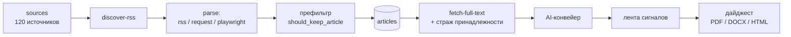
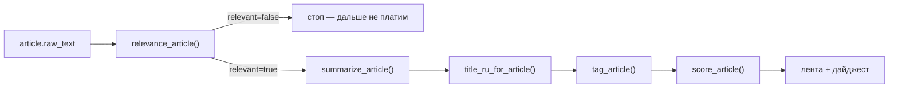

# OilTech Digest: архитектура

Документ описывает систему в том виде, в каком она реально работает на проде.
Сверено с кодом на коммите `499cd17` (2026-08-02).

Схемы (каждая — одна страница A3, для печати и для встреч):

- [`architecture_diagram.html`](architecture_diagram.html) — единая схема
  «бизнес-логика → функции → контейнеры и серверы»;
- [`architecture_dataflow.html`](architecture_dataflow.html) — потоки данных и границы
  доверия (DFD): что пересекает периметр, чем аутентифицируется, какого класса данные.

---

## 1. Что это за система

Собирает отраслевые новости из ~120 источников, отсеивает нерелевантное, оценивает
оставшееся с помощью LLM (важность, направление, балл бизнес-эффекта) и даёт аналитику
собрать из этого месячный дайджест для заказчика в PDF / DOCX / HTML.

Ключевое архитектурное решение — **геораспределённость**. Ядро (интерфейс, база,
управление) работает в России; всё, что зависит от зарубежной сети (OpenAI, западные
источники), вынесено во внешний контур. Главный принцип:

> **РФ-ядро не делает синхронных вызовов во внешнюю сеть в пользовательском request path.**

При недоступности внешнего контура админка продолжает работать на уже собранных данных,
а внешние задачи копятся в очереди и явно показывают деградацию.

---

## 2. Контуры и размещение

### РФ-ядро — Санкт-Петербург, `109.68.213.12`, `docker-compose.yml`

| Контейнер | Роль | Порт |
|---|---|---|
| `oiltech_caddy` | reverse-proxy, авто-HTTPS Let's Encrypt, сжатие zstd/gzip | **80, 443 наружу** |
| `oiltech_app` | FastAPI + собранный React-фронт, сессии, роли | `127.0.0.1:8000` |
| `oiltech_pg` | PostgreSQL 16 — всё состояние системы | `127.0.0.1:5432` |
| `oiltech_scheduler` | цикл сбора и обработки, по умолчанию раз в 6 ч | — |
| `oiltech_worker` | фоновые задачи, очереди `default`, `ai` | — |
| `oiltech_playwright_worker` | очередь `playwright`: JS-сайты и рендер PDF | — |
| `oiltech_tasks` | трекер задач (тот же образ, `TASKS_APP_MODE=1`) | `127.0.0.1:8010` |
| `oiltech_docs` | справка на mkdocs-material | `127.0.0.1:8081` |
| `oiltech_bootstrap` | одноразовый: `init-db` + сиды, затем выходит | — |

Наружу открыт только Caddy. Всё остальное слушает loopback — БД снаружи недоступна.

### Внешний контур — Амстердам, `85.234.107.233`, `docker-compose.external-worker.yml`

Один контейнер `oiltech_external_worker`. **Stateless**: своей базы нет, соединения с
РФ-базой нет by design. Общается с ядром только по HTTPS task-API.

Очереди: `external-ai`, `external-fetch`, `external-playwright`.
Возможности: `openai`, `http_fetch`, `playwright`.

Почему не дать воркеру прямой доступ к Postgres: пришлось бы открывать БД наружу или
строить VPN; при сетевых проблемах зависают соединения; сложнее ограничить права и
аудировать, что именно внешний сервер прочитал.

---

## 3. Конвейер

### 3.1 Общий поток


```mermaid
flowchart LR
  SRC["sources<br/>120 источников"] --> DISC["discover-rss"]
  DISC --> PARSE["parse:<br/>rss / request / playwright"]
  PARSE --> PREF["префильтр<br/>should_keep_article"]
  PREF --> ART[("articles")]
  ART --> FULL["fetch-full-text<br/>+ страж принадлежности"]
  FULL --> AI["AI-конвейер"]
  AI --> UI["лента сигналов"]
  UI --> DIG["дайджест<br/>PDF / DOCX / HTML"]
```

### 3.2 Сбор

Три стратегии обхода, выбор — в поле `sources.parse_strategy`:

- `rss` — [`rss_parser.parse_all()`](../oiltech_digest/ingestion/rss_parser.py);
- `request` — [`request_parser.parse_source()`](../oiltech_digest/ingestion/request_parser.py):
  мониторит `listing_url`, вытаскивает ссылки, сверяет с известными `url`, берёт только новое.
  Инкрементальность держится на `last_seen_article_url`, `last_seen_published_at`, `last_listing_hash`;
- `playwright` — [`playwright_parser.parse_source()`](../oiltech_digest/ingestion/playwright_parser.py)
  для сайтов, которые рендерят листинг скриптами.

Дальше — детерминированный префильтр
[`relevance_filter.should_keep_article()`](../oiltech_digest/ingestion/relevance_filter.py):
отсекает явный шум **без единого AI-вызова**, то есть бесплатно.

Дедупликация точных повторов: `content_hash = sha256(нормализованный title | url)`.
Кросс-источниковые перепечатки этим не ловятся — см. §8.

### 3.3 Дозагрузка полного текста

RSS часто отдаёт только анонс. Тогда статья ложится с `text_truncated = true`, и
[`article_fetcher.fetch_full_text()`](../oiltech_digest/ingestion/article_fetcher.py)
идёт по `url` за полным текстом.

**Страж принадлежности текста** (введён 28.07 после дефекта №24, коммит `1c33303`).
До него `_is_better_text` сравнивал тексты **только по длине** — поэтому листинг, пейвол
или чужой материал из JSON-LD побеждали настоящую статью, писались со статусом `ok` и
больше не перепроверялись. Порча помечалась успехом. Сейчас перед записью два рубежа
в `_ownership_rejection()`:

1. `normalize.title_matches_body()` — пересечение значимых слов заголовка с телом,
   посегментно (сплошное сравнение топило верные статьи из-за хвоста издания);
2. `normalize.compute_body_hash()` + индекс `(source_id, body_hash)` — «такое тело уже
   есть у другой статьи этого источника» означает отказ.

Отказ даёт `full_text_status = 'mismatch'` и **не затирает** прежний текст.

Фиксируется: `full_text_fetched_at`, `full_text_status`, `full_text_error`,
`extraction_method`, `body_hash`.

### 3.4 AI-конвейер

Порядок стадий в
[`pipeline.process_pipeline_articles()`](../oiltech_digest/processing/pipeline.py):

```text
релевантность → суть → перевод заголовка → тег → скоринг
```


```mermaid
flowchart LR
  A["article.raw_text"] --> R["relevance_article()"]
  R -->|relevant=false| X["стоп — дальше не платим"]
  R -->|relevant=true| S["summarize_article()"]
  S --> TR["title_ru_for_article()"]
  TR --> T["tag_article()"]
  T --> SC["score_article()"]
  SC --> RES["лента + дайджест"]
```

Почему релевантность **первой**, а не после сути: гейт работает на сыром тексте — без
смещения от уже написанной сути и без лишних оплаченных вызовов по мусору. Нерелевантные
не тегируются и не скорятся.

Каждый вызов пишет строку в `ai_processing_runs` через `_record_run()` — модель, токены,
стоимость, статус. Это же таблица аудита затрат.

Модели задаются пер-стадийно, потому что цена ошибки разная (см.
[`config.py`](../oiltech_digest/config.py)):

| Стадия | Переменная | Почему отдельно |
|---|---|---|
| гейт релевантности | `OPENAI_RELEVANCE_MODEL` | вызов дешёвый, цена ошибки высокая → модель сильнее и reasoning `medium` |
| скоринг | `OPENAI_SCORE_MODEL` | балл прямо определяет отбор в дайджест; при `minimal` reasoning баллы систематически занижались |
| перевод | `OPENAI_TRANSLATE_MODEL` | ответ короткий, хватает дешёвой модели |

⚠️ Эти переменные задаются в `.env` **того сервера, где реально вызывается OpenAI** —
то есть внешнего воркера. Инцидент 06.2026: их прописали в ядре, гейт тихо откатился на
слабую модель, качество выборки просело.

### 3.5 Тот же конвейер во внешнем контуре

Когда `AI_EXECUTION_REGION=external`, ядро не зовёт OpenAI, а ставит задачу в очередь:

```text
ядро:   build_process_articles_payload()   → самодостаточный JSON (статьи, теги, критерии)
воркер: process_payload()                  → вызовы OpenAI
ядро:   apply_process_result()             → запись карточек, тегов, баллов, биллинга
```

Роутинг решает [`network_policy.py`](../oiltech_digest/network_policy.py) — единственное
место, где принимается решение «локально или наружу».

---

## 4. Протокол внешних задач

Machine-to-machine API, воркер всегда инициирует связь сам:

| Endpoint | Назначение |
|---|---|
| `POST /api/external-worker/claim` | забрать задачу, получить одноразовый `lease_token` |
| `POST /api/external-worker/jobs/{id}/heartbeat` | продлить lease |
| `POST /api/external-worker/jobs/{id}/progress` | сообщить прогресс |
| `POST /api/external-worker/jobs/{id}/complete` | сдать результат |
| `POST /api/external-worker/jobs/{id}/fail` | сообщить об ошибке |

Аутентификация — Bearer-токен; на сервере хранится только SHA-256, сравнение через
`hmac.compare_digest`. У каждой задачи свой `lease_token`.

Три механики, за каждой стоит оплаченный деньгами инцидент:

- **`finalizing`** — завершение застолбляется атомарно до применения результата, иначе
  истёкший lease переотдавал задачу и OpenAI биллил дважды (T2, счёт ×2);
- **`LeaseLost`** — heartbeat вернул 409, значит ядро отозвало право на работу;
  воркер обязан оборвать батч. Раньше 409 глушился и воркер жёг ~$11/час в мусор (T20);
- **lease, а не настенные часы** — признак жизни внешней задачи это продлённый lease.
  Пока это был таймаут в 60 минут, батч на 93 минуты попадал в вечную петлю: на 60-й
  минуте задача переочередивалась, воркер получал 409 и начинал заново. Круг ровно в час,
  каждый раз за деньги (T22).

---

## 5. Модель хранения

PostgreSQL 16, `psycopg` и SQL вручную, без ORM: схема простая, важна прозрачность запросов
и точечные правки под batch-обработку.

**Контент и оценки:** `sources` · `articles` · `article_cards` (суть, релевантность) ·
`tags` + `article_tags` · `scoring_criteria` + `article_scores` + `article_score_items`.

**Пользователи:** `users` (e-mail, PBKDF2-хэш, роль) · `user_sessions` ·
`user_article_states` — **личное** состояние: статус статьи (`new` / `review` / `digest` /
`archive` / `noise` / `duplicate`) и комментарий аналитика.

Модель разделения: статьи, оценки, теги и источники — **общие**; пер-юзерный только
рабочий статус и состав дайджеста.

**Дайджест:** `monthly_digests` (уникальность по `(user_id, month)`) · `monthly_digest_items`.

**Служебное:** `background_jobs` (владелец, очередь, регион исполнения, lease, попытки) ·
`ai_processing_runs` (аудит каждого AI-вызова и его стоимости) · `export_jobs`.

Удаление статей — **мягкое**: `articles.pending_deletion`. Физическое удаление
(`purge`) сносит и строки `ai_processing_runs`, то есть уничтожает историю затрат.

---

## 6. Доступ и роли

Вход по e-mail и паролю: PBKDF2-HMAC-SHA256, 200 000 итераций, соль 16 байт на пользователя
([`auth.py`](../oiltech_digest/auth.py)). Сессия — cookie `HttpOnly` + `Secure` +
`SameSite=Lax`, срок 30 дней.

Две роли, гейты `require_user()` / `require_admin()` в
[`api.py`](../oiltech_digest/api.py):

- **`user`** — своя лента, свои статусы, свой дайджест, чтение источников и справочников;
- **`admin`** — плюс управление источниками, тегами, критериями, пользователями,
  брендингом дайджеста, обслуживанием и **запуск платной AI-обработки**.

API не разделён на публичный и внутренний — это внутренний backend админки.

Аудит приватности 24.07 закрыл пять дефектов: доступ к чужому дайджест-PDF по номеру
задачи, правку общего брендинга любым пользователем, вызов обслуживания (удаляло историю
задач всем), победу чужого дайджеста над личным из-за `NULLS FIRST`, неполную очистку
состояния фронта при 401.

---

## 7. Цикл scheduler

[`scripts/docker-scheduler.sh`](../scripts/docker-scheduler.sh), по умолчанию раз в 6 часов:

```text
maintenance-cleanup       (раз в 24 цикла)
discover-rss              (раз в 24 цикла)
parse                     → сбор со всех включённых источников
fetch-full-text           → дозагрузка + страж принадлежности
process | enqueue-process → AI локально ИЛИ задача во внешнюю очередь
enqueue-external-scrape   → если FETCH_EXTERNAL_ENABLED=1
stats
```

Есть альтернативный режим `STREAMING_PIPELINE=1`: `parse-process` вместо трёх шагов —
статья проходит весь путь целиком, карточки появляются по мере готовности. На сервере
с 1.9 ГБ RAM требует `PARSE_WORKERS ≤ 5`.

---

## 8. Известные ограничения

- **Кросс-источниковые перепечатки не ловятся.** `content_hash` берёт только точный повтор
  того же URL. Один инфоповод от трёх изданий = три статьи. Механизм подобран пробой на
  данных (27–28.07): лексика не годится (косинус 0.11–0.47 на реальном кейсе), эмбеддинги
  решают (0.754–0.842); нужны две защиты — только кросс-источниковые пары и guard по числам.
  Задача №21.
- **Нет автоматических бэкапов.** Дампы снимаются вручную и лежат на том же сервере.
  Задача №17.
- **Ресурс сервера на пределе:** 1.9 ГБ RAM, свободно ~116 МБ; сборка образа при живом
  стеке рискует OOM. Задача №10.
- **`pgvector` на проде отсутствует** (`postgres:16`, доступен только `pg_trgm`) — влияет
  на выбор реализации №21.
- **Проверка типов фронта выключена в сборке образа** (`Dockerfile` вызывает `vite build`
  без `tsc -b`) ради экономии памяти. Тех-долг T12.
- **Трекер задач пишет в `BACKLOG.md`** — файл под git. Деплой через `git reset --hard`
  сотрёт задачи, созданные через UI. Тех-долг T11.
- **Батч всё-или-ничего:** результат внешней задачи сохраняется только в `complete`,
  промежуточных чекпойнтов нет. Тех-долг T23.

---

## 9. Конфигурация

Полный список — [`.env.example`](../.env.example). Существенное:

| Переменная | Смысл |
|---|---|
| `DATABASE_URL` | подключение к Postgres |
| `EXTERNAL_WORKERS_ENABLED` | главный рубильник внешнего контура |
| `AI_EXECUTION_REGION` | `ru` — считаем сами, `external` — отдаём воркеру |
| `FETCH_EXTERNAL_ENABLED` | разрешить внешний сбор источников с `network_region='external'` |
| `EXTERNAL_WORKER_TOKEN_HASH` | SHA-256 токена воркера (на стороне ядра) |
| `CORE_API_URL`, `EXTERNAL_WORKER_TOKEN` | на стороне воркера |
| `OPENAI_API_KEY`, `OPENAI_MODEL` | базовые параметры LLM |
| `OPENAI_RELEVANCE_MODEL` / `_SCORE_MODEL` / `_TRANSLATE_MODEL` | пер-стадийные модели |
| `CYCLE_INTERVAL_SECONDS` | период цикла scheduler |
| `AUTH_COOKIE_SECURE` | `0` только для локальной разработки по http |

Секреты в git не попадают. Отдельного хранилища секретов нет.

---

## 10. Развёртывание

```bash
git fetch origin && git reset --hard origin/main
docker compose down          # обязательно: сборка при живом стеке даёт OOM
docker compose build
docker compose up -d
```

⚠️ Именно `reset --hard`, а не `pull` — прод расходился с локальным main.
⚠️ Не деплоить при активных AI-задачах: рестарт рвёт lease внешнего воркера.
