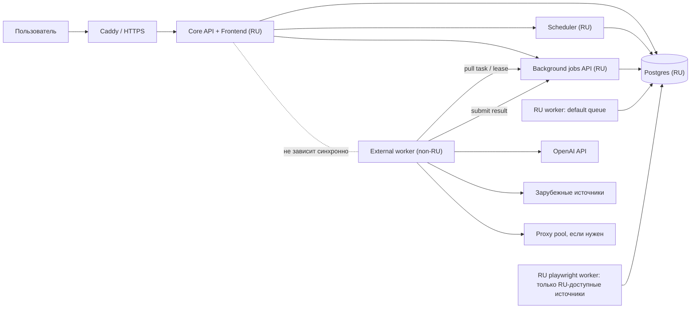

# Геораспределенная архитектура: РФ core + внешний контур

## Цель

Перевести продукт на архитектуру, где основной интерфейс, база и управление работают
на российских серверах, а операции, зависящие от зарубежной сети, выполняются во
внешнем контуре. При блокировке зарубежного сервера или нестабильности канала
приложение не должно зависать: пользователь продолжает работать с уже собранными
данными, а внешние задачи копятся, ретраятся и явно показывают деградацию.

## Главный принцип

Core в РФ не делает синхронных вызовов во внешнюю сеть в пользовательских API.

Разрешено:

- читать и менять локальные данные;
- создавать фоновые задачи;
- показывать статус очередей;
- экспортировать дайджест из уже готовых данных;
- выполнять РФ-доступные парсеры локально.

Запрещено в пользовательском request path:

- ждать OpenAI;
- ждать зарубежный сайт;
- ждать зарубежный worker;
- ждать proxy/VPN;
- выполнять Playwright-парсинг внешнего сайта синхронно.

## Целевая схема



## Разделение по контурам

### РФ core

Остается в российском контуре:

- `frontend` и `FastAPI`;
- `Postgres`;
- `Caddy`;
- auth/session;
- CRUD статей, источников, тегов, скоринга;
- формирование дайджеста из готовых данных;
- локальный `scheduler`;
- локальные workers для РФ-доступных задач;
- `maintenance`, `readiness`, `benchmark`;
- job metadata и история запусков.

Core должен быть полностью работоспособен при недоступном внешнем контуре.

### Внешний контур

Выносится на зарубежный сервер:

- OpenAI pipeline:
  - `summary`;
  - `relevance`;
  - `tagging`;
  - `scoring`;
- сбор источников, недоступных из РФ;
- Playwright-парсинг сайтов с блокировками;
- Telegram/LinkedIn/другие каналы, если они нестабильны из РФ;
- proxy orchestration, если конкретному источнику нужен отдельный egress.

Внешний контур должен быть stateless. Он не должен владеть базой и не должен быть
обязательным для открытия админки.

## Почему не прямой доступ внешнего worker к Postgres

Текущие Docker workers работают через `DATABASE_URL` и напрямую claim-ят задачи из
Postgres. Для одного сервера это нормально, но для геораспределенной схемы это плохая
граница:

- нужно открывать БД наружу или строить сложный VPN;
- при проблемах сети зависают DB-соединения;
- сложнее ограничить права внешнего контура;
- OpenAI-ключи и парсинговая сеть оказываются слишком близко к core database;
- тяжелее аудировать, что именно внешний сервер прочитал или изменил.

Целевая модель: внешний worker общается только с `core API` по task-протоколу.

## Task API для внешнего контура

Нужен отдельный machine-to-machine API. Минимальный контракт:

### Получить задачу

`POST /api/external-worker/claim`

Payload:

```json
{
  "worker_id": "eu-worker-1",
  "queues": ["external-ai", "external-fetch", "external-playwright"],
  "capabilities": ["openai", "http_fetch", "playwright"],
  "max_lease_seconds": 600
}
```

Response:

```json
{
  "job": {
    "id": 123,
    "kind": "ai_process_article",
    "queue": "external-ai",
    "lease_token": "signed-token",
    "payload": {
      "article_id": 456,
      "title": "...",
      "text": "...",
      "language": "en"
    }
  }
}
```

Если задач нет:

```json
{ "job": null }
```

### Обновить прогресс

`POST /api/external-worker/jobs/{id}/progress`

```json
{
  "lease_token": "signed-token",
  "progress": 55,
  "message": "scoring"
}
```

### Вернуть результат

`POST /api/external-worker/jobs/{id}/complete`

```json
{
  "lease_token": "signed-token",
  "result": {
    "summary": "...",
    "relevant": true,
    "tags": [...],
    "score": {...}
  }
}
```

### Вернуть ошибку

`POST /api/external-worker/jobs/{id}/fail`

```json
{
  "lease_token": "signed-token",
  "error": "openai timeout",
  "retryable": true,
  "retry_after_seconds": 300
}
```

## Очереди

Текущие очереди:

- `default`;
- `ai`;
- `playwright`.

Целевые очереди:

- `default` - локальные быстрые задачи в РФ;
- `ru-fetch` - парсинг источников, доступных из РФ;
- `ru-playwright` - browser-задачи, доступные из РФ;
- `external-fetch` - сайты, недоступные или нестабильные из РФ;
- `external-playwright` - сложные зарубежные сайты;
- `external-ai` - OpenAI pipeline;
- `exports` - экспорты файлов, если нужно отделить от default.

## Классификация источников

В `sources` нужно добавить сетевой профиль:

- `network_region`: `ru`, `external`, `auto`;
- `network_profile`: `direct`, `proxy`, `browser`;
- `last_ru_probe_status`;
- `last_external_probe_status`;
- `external_required_reason`;
- `external_cooldown_until`.

Логика:

- RSS/HTML доступен из РФ - обрабатывается локально;
- 403/429/DNS timeout/TLS timeout из РФ - источник переводится в `external`;
- если внешний контур недоступен - задачи остаются queued/deferred;
- UI показывает, что источник требует внешнего доступа, но не ломает страницу.

## Разделение pipeline

Сейчас `process_articles` выполняет весь AI pipeline одной задачей:

- summary;
- relevance;
- tag;
- score.

Для геораспределенной схемы лучше разделить на более мелкие job kind:

- `ai_summarize_article`;
- `ai_check_relevance`;
- `ai_tag_article`;
- `ai_score_article`;
- `ai_process_article` как совместимый wrapper на переходный период.

Преимущество:

- проще ретраить только упавший шаг;
- проще видеть деградацию;
- можно частично обработать статью;
- можно менять provider для отдельных шагов;
- проще ставить лимиты по стоимости.

## Данные, передаваемые наружу

Во внешний контур передаем только минимально необходимое:

- `article_id`;
- `source_id`;
- title;
- URL;
- raw/full text;
- language;
- теги и scoring criteria, необходимые для промпта;
- correlation/job id.

Не передаем:

- user sessions;
- auth data;
- всю таблицу источников;
- внутренние комментарии пользователей, если они не нужны;
- полный дамп БД;
- настройки инфраструктуры core.

## Таймауты и деградация

Для всех внешних задач:

- короткий HTTP timeout на уровне worker;
- lease timeout на уровне core;
- exponential backoff;
- max attempts;
- terminal status `failed`;
- статус `deferred_external_unavailable`, если внешний контур недоступен;
- отдельные метрики по queue и region.

UI должен показывать:

- `queued`;
- `running`;
- `retry scheduled`;
- `external unavailable`;
- `failed`;
- `done`.

## Секреты

В РФ core:

- `DATABASE_URL`;
- auth/session secrets;
- machine-token public verification или hash;
- без `OPENAI_API_KEY`, если AI полностью вынесен.

Во внешнем контуре:

- `EXTERNAL_WORKER_TOKEN`;
- `OPENAI_API_KEY`;
- proxy credentials;
- source-specific credentials, если появятся.

Ключ OpenAI лучше не хранить на РФ-сервере после выноса AI.

## Модули, которые нужно выделить

### `oiltech_digest/jobs`

Цель: вынести job contracts из `background_jobs.py`.

Состав:

- registry job kind;
- queue routing;
- payload schemas;
- result schemas;
- retry policy;
- region policy.

### `oiltech_digest/external_worker_api.py`

Цель: API для зарубежных workers.

Состав:

- claim;
- progress;
- complete;
- fail;
- heartbeat;
- worker capabilities.

### `oiltech_digest/workers/external_worker.py`

Цель: клиентский worker, запускаемый на зарубежном сервере.

Состав:

- poll loop;
- lease handling;
- task dispatch;
- result submit;
- retry-safe behavior;
- structured logs.

### `oiltech_digest/network_policy.py`

Цель: принять решение, где выполнять задачу.

Вход:

- source;
- task kind;
- last probe;
- env flags;
- manual override.

Выход:

- queue name;
- region;
- network profile.

### `oiltech_digest/ingestion/probes.py`

Цель: отдельно проверять доступность из РФ и из external worker.

Результаты нужны для маршрутизации источников.

### `oiltech_digest/processing/tasks.py`

Цель: сделать AI steps задачами с чистыми входами/выходами.

Это позволит запускать один и тот же код локально, во внешнем worker или в тестах.

## Изменения в БД

### `background_jobs`

Добавить поля:

- `lease_token_hash TEXT`;
- `lease_expires_at TIMESTAMPTZ`;
- `claimed_by TEXT`;
- `execution_region TEXT DEFAULT 'ru'`;
- `capability TEXT`;
- `last_heartbeat_at TIMESTAMPTZ`;
- `external_status TEXT`;
- `last_error_code TEXT`.

### `sources`

Добавить поля:

- `network_region TEXT DEFAULT 'auto'`;
- `network_profile TEXT DEFAULT 'direct'`;
- `last_ru_probe_status TEXT`;
- `last_external_probe_status TEXT`;
- `external_required_reason TEXT`;
- `external_cooldown_until TIMESTAMPTZ`.

### `articles`

Опционально добавить:

- `fetch_region TEXT`;
- `processing_region TEXT`;
- `last_pipeline_error TEXT`.

## Docker / deployment

### РФ compose

Остаются:

- `db`;
- `bootstrap`;
- `app`;
- `worker` для `default,ru-fetch`;
- `playwright-worker` для `ru-playwright`;
- `scheduler`;
- `caddy`.

Добавить env:

- `CORE_PUBLIC_URL=https://...`;
- `EXTERNAL_WORKERS_ENABLED=1`;
- `EXTERNAL_WORKER_TOKEN_HASH=...`;
- `AI_EXECUTION_REGION=external`;
- `FETCH_EXTERNAL_ENABLED=1`.

### External compose

Новый файл: `docker-compose.external-worker.yml`.

Сервисы:

- `external-worker`;
- опционально `external-playwright-worker`, если нужно разделить browser RAM;
- без Postgres;
- без Caddy;
- без frontend.

Env:

- `CORE_API_URL=https://core-domain.ru`;
- `EXTERNAL_WORKER_ID=eu-worker-1`;
- `EXTERNAL_WORKER_TOKEN=...`;
- `EXTERNAL_WORKER_QUEUES=external-ai,external-fetch,external-playwright`;
- `OPENAI_API_KEY=...`;
- `PROXY_URL=...`;
- `HTTP_MIN_INTERVAL_SECONDS=...`.

## Backlog

### Этап 0. Зафиксировать текущую baseline-надежность

Цель: перед разрезанием архитектуры понимать, что ничего не сломали.

Задачи:

1. Прогнать backend tests и frontend build.
2. Прогнать `bench-readiness` на продовой копии или на проде read-only.
3. Снять текущие counts: articles, sources, background_jobs.
4. Зафиксировать текущий deployment runbook.
5. Проверить, что hidden pages `?screen=jobs` и `?screen=maintenance` доступны админу.

Критерий готовности:

- есть цифры baseline;
- есть текущий backup plan;
- есть понятная команда rollback.

### Этап 1. Ввести execution policy без внешнего сервера

Цель: подготовить код к маршрутизации задач, не меняя инфраструктуру.

Задачи:

1. Создать `network_policy.py`.
2. Добавить queue mapping по `task kind + source network_region`.
3. Добавить новые queue names в config.
4. Добавить поля `execution_region`, `capability` в `background_jobs`.
5. Добавить поля `network_region`, `network_profile` в `sources`.
6. Обновить enqueue-места:
   - scrape source;
   - diagnose source;
   - process articles.
7. Оставить все задачи исполняемыми локально для совместимости.
8. Покрыть routing unit-тестами.

Критерий готовности:

- код умеет назначать `external-*` очереди;
- старый локальный режим продолжает работать;
- тесты проходят.

### Этап 2. Разделить AI pipeline на task-level контракты

Цель: сделать AI-обработку переносимой во внешний worker.

Задачи:

1. Вынести payload/result schemas для AI задач.
2. Добавить job kinds:
   - `ai_summarize_article`;
   - `ai_check_relevance`;
   - `ai_tag_article`;
   - `ai_score_article`;
   - `ai_process_article`.
3. Сохранить текущий `process_articles` как wrapper.
4. Сделать idempotent-запись результата каждого шага.
5. Добавить retry только для упавшего шага.
6. Добавить тесты на partial processing.
7. Добавить UI-индикаторы частичной обработки, если данных достаточно.

Критерий готовности:

- одну статью можно обработать по шагам;
- повторный запуск не портит данные;
- wrapper сохраняет текущий UX.

### Этап 3. External Worker API

Цель: дать зарубежному worker безопасный способ брать и сдавать задачи без доступа к БД.

Задачи:

1. Добавить machine auth:
   - bearer token;
   - hash/token id в config;
   - audit logs.
2. Реализовать `claim`.
3. Реализовать lease token.
4. Реализовать `progress`.
5. Реализовать `complete`.
6. Реализовать `fail`.
7. Реализовать `heartbeat`.
8. Добавить requeue expired lease.
9. Добавить тесты:
   - claim only allowed queues;
   - complete with wrong lease rejected;
   - expired lease requeued;
   - retryable fail schedules retry;
   - terminal fail respects max attempts.

Критерий готовности:

- внешний процесс может выполнить задачу через HTTP;
- БД наружу не открывается;
- потеря worker не оставляет вечный `running`.

### Этап 4. External worker runtime

Цель: отдельный worker-контейнер для зарубежного сервера.

Задачи:

1. Создать `oiltech_digest/workers/external_worker.py`.
2. Добавить CLI команду `external-worker`.
3. Добавить dispatch handlers:
   - OpenAI AI tasks;
   - request fetch;
   - playwright fetch.
4. Добавить graceful shutdown.
5. Добавить structured logs.
6. Добавить env-based capabilities.
7. Добавить `docker-compose.external-worker.yml`.
8. Добавить docs для запуска external worker.

Критерий готовности:

- worker запускается без Postgres;
- берет задачу с core API;
- выполняет;
- возвращает результат;
- корректно переживает restart.

### Этап 5. Вынести OpenAI во внешний контур

Цель: убрать зависимость РФ-сервера от OpenAI API.

Задачи:

1. Поставить `AI_EXECUTION_REGION=external`.
2. Перенаправить AI jobs в `external-ai`.
3. Убрать `OPENAI_API_KEY` с РФ-сервера.
4. Добавить UI/maintenance статус external AI queue.
5. Добавить алерт на рост `external-ai queued`.
6. Прогнать контрольную обработку 10 статей.
7. Проверить, что при выключенном external worker:
   - админка открывается;
   - статьи видны;
   - задачи остаются queued/deferred;
   - UI не висит.

Критерий готовности:

- OpenAI вызывается только с зарубежного сервера;
- РФ core работает без доступа к OpenAI.

### Этап 6. Вынести проблемные источники

Цель: не терять сбор по источникам, недоступным из РФ.

Задачи:

1. Добавить source probe из РФ.
2. Добавить source probe из external worker.
3. Добавить автоматический перевод источника в `external`.
4. Добавить ручной override в UI источников.
5. Перенаправить external sources в `external-fetch` / `external-playwright`.
6. Добавить health report по регионам.
7. Добавить тесты маршрутизации.
8. Прогнать 5-10 известных проблемных источников.

Критерий готовности:

- источник с блокировкой РФ собирается внешним worker;
- источник без блокировки продолжает собираться в РФ;
- UI показывает причину маршрутизации.

### Этап 7. Деградация и наблюдаемость

Цель: сделать проблему внешнего контура видимой, но не критичной.

Задачи:

1. Добавить `/api/external-workers/status`.
2. Хранить heartbeat workers.
3. Добавить cards на maintenance page:
   - active external workers;
   - oldest queued external job;
   - external fail rate;
   - external unavailable since.
4. Добавить circuit breaker:
   - если external worker не heartbeat N минут, новые external jobs получают статус `deferred`;
   - scheduler не создает бесконечную волну одинаковых задач.
5. Добавить CLI:
   - `external-workers-status`;
   - `jobs-requeue-external`;
   - `jobs-pause-external`;
   - `jobs-resume-external`.
6. Добавить production ops docs.

Критерий готовности:

- оператор за 1 минуту понимает, что сломалось;
- приложение продолжает работать;
- накопленные задачи можно безопасно догнать.

### Этап 8. Security hardening

Цель: ограничить риски внешнего контура.

Задачи:

1. Token rotation procedure.
2. Scope tokens by queues/capabilities.
3. Rate limit external worker API.
4. Audit log для claim/complete/fail.
5. Запретить external worker читать произвольные статьи.
6. Маскировать секреты в logs.
7. Добавить allowlist worker ids.
8. Добавить опциональный mTLS/VPN, если инфраструктура позволит.

Критерий готовности:

- компрометация external worker не дает прямого доступа к БД;
- токен можно быстро отозвать;
- есть аудит действий.

### Этап 9. Production migration

Цель: перевести прод без потери базы.

Задачи:

1. Сделать backup Postgres.
2. Обновить core код в РФ.
3. Применить schema migrations через `init-db`.
4. Запустить core без external worker.
5. Проверить UI/readiness/maintenance.
6. Запустить external worker с пустыми очередями.
7. Перевести `AI_EXECUTION_REGION=external`.
8. Прогнать 10 AI задач.
9. Перевести 2-3 проблемных источника на `external`.
10. Наблюдать сутки.
11. Расширить external routing на остальные проблемные источники.

Критерий готовности:

- текущая база сохранена;
- core доступен при отключенном external worker;
- external worker реально обрабатывает AI и проблемные источники;
- есть rollback на локальную обработку или offline режим.

## Приоритетная реализация

Рекомендуемый порядок разработки:

1. `network_policy` и поля БД.
2. External Worker API.
3. External worker runtime.
4. Вынос OpenAI.
5. Вынос проблемных источников.
6. UI/ops visibility.
7. Security hardening.

Причина: OpenAI проще и безопаснее вынести первым. Там чистый request/response
pipeline, меньше разнообразия сетевых ошибок, и сразу снимается зависимость РФ-core
от зарубежного API.

## Минимальный MVP

MVP можно считать готовым, когда:

- core живет в РФ;
- внешний worker живет за рубежом;
- OpenAI pipeline выполняется только внешним worker;
- пользовательский UI не ждет внешний контур;
- при выключенном внешнем worker статьи, фильтры, источники, дайджесты и jobs page
  продолжают открываться;
- AI jobs остаются в очереди и догоняются после восстановления worker.

## Риски

Основные риски:

- протечки секретов во внешний контур;
- слишком широкий payload задач;
- дублирование обработки при retry;
- зависшие leases;
- неконтролируемый рост очереди при долгой блокировке;
- рост стоимости OpenAI при массовом retry;
- сложность отладки Playwright во внешнем окружении.

Снижение рисков:

- маленькие task payloads;
- idempotent writes;
- lease + heartbeat;
- max attempts + dead-letter;
- circuit breaker;
- maintenance UI;
- read-only benchmark;
- отдельные лимиты по очередям.

