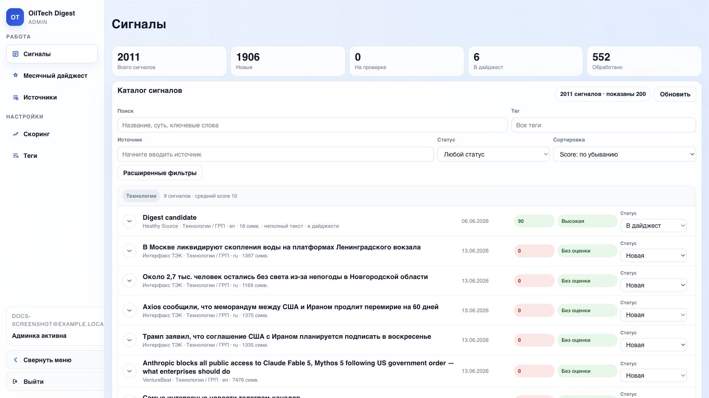

# Документация разработчика

Этот раздел описывает устройство системы, основные модули, контракты API, фоновые задачи, external worker, деплой и эксплуатацию.

## Архитектура

```text
sources -> parse -> articles -> fetch-full-text -> summary -> relevance -> tag -> score -> digest
```

Слои системы:

| Слой | Ответственность |
|---|---|
| ingestion | RSS, request/listing, Telegram, Playwright |
| storage | PostgreSQL, schema.sql, repository |
| processing | AI pipeline, scoring, digest rendering |
| delivery | FastAPI API, React admin, MkDocs docs-сервис |
| operations | Docker, scheduler, background jobs, maintenance, external worker |

!!! warning "Правило API"
    Пользовательские API не должны синхронно ждать внешнюю сеть. Тяжелые операции оформляются как background jobs.

## Admin UI



Основные экраны админки:

| Экран | Основные backend-контракты |
|---|---|
| Сигналы | `GET /api/articles`, `PATCH /api/articles/{id}`, `GET /api/stats` |
| Месячный дайджест | `GET /api/digest`, `POST /api/jobs/digest-export`, `POST /api/monthly-digests` |
| Источники | `GET /api/sources`, `PATCH /api/sources/{id}`, diagnostics/scrape jobs |
| Скоринг | критерии score и AI-оценка |
| Теги | справочник тематик и AI-тегирование |

## Модули

| Модуль | Ответственность |
|---|---|
| `oiltech_digest/api.py` | FastAPI endpoints, auth, frontend, external worker API |
| `oiltech_digest/cli.py` | CLI команды init, seed, parse, process, jobs |
| `oiltech_digest/db/schema.sql` | идемпотентная PostgreSQL schema |
| `oiltech_digest/db/repository.py` | SQL access layer |
| `oiltech_digest/background_jobs.py` | DB-backed worker runtime |
| `oiltech_digest/network_policy.py` | маршрутизация РФ/external задач |
| `oiltech_digest/external_worker.py` | pull-worker для зарубежного сервера |
| `oiltech_digest/processing/domain_glossary.py` | применение и проверка нефтегазового глоссария |
| `oiltech_digest/processing/domain_glossary.json` | термины, фразовые исправления и golden-кейсы перевода |
| `oiltech_digest/processing/external_ai.py` | self-contained AI payload |
| `oiltech_digest/ingestion/external_fetch.py` | external fetch/playwright payload |
| `frontend/src` | React admin |
| `docs/help` | MkDocs Material documentation service |

## Нефтегазовая терминология

Суть сигнала и перевод заголовка используют доменный глоссарий:

```text
oiltech_digest/processing/domain_glossary.json
```

Задача слоя - не общий машинный перевод, а нормализация отраслевых терминов. Например:

| Английский термин | Preferred RU | Запрещенный вариант |
|---|---|---|
| `hydraulic fracturing`, `fracking`, `frac stimulation` | `ГРП` | `фракинг` |
| `well completion` | `заканчивание скважины` | `завершение скважины` |
| `workover` | `КРС` | `ворковер` |
| `enhanced oil recovery`, `EOR` | `МУН` | - |
| `drilling fluid`, `drilling mud` | `буровой раствор` | `буровая грязь` |

Как работает:

1. Перед AI-вызовом система ищет релевантные термины в `title`, `raw_text`, `summary`.
2. В prompt добавляется только компактный блок найденных терминов, а не весь словарь.
3. Модель получает прямое правило: использовать `preferred_ru` и не использовать `forbidden_ru`.
4. После ответа безопасные запрещенные варианты заменяются детерминированно.
5. Для частых плохих переводов поддерживаются regex-паттерны падежных форм: например
   `фракинга`, `фракингом`, `ворковеров`, `оффшоре`, `резервуара`.
6. При сборке дайджеста summary/title дополнительно прогоняются через словарь, чтобы старые
   карточки в базе не протащили плохой термин в PDF/DOCX.

Расширение словаря:

- добавлять термин в `domain_glossary.json`;
- указывать все частые английские варианты в `source_terms`;
- фиксировать один продуктовый `preferred_ru`;
- добавлять `forbidden_ru`, если модель часто выбирает плохой перевод;
- добавлять `forbidden_patterns`, если плохой перевод встречается в разных падежах;
- добавлять пример в `golden_cases`;
- проверять словарь командой `python -m oiltech_digest.cli validate-terminology`;
- искать старые плохие карточки командой `python -m oiltech_digest.cli audit-terminology --limit 1000`;
- перед массовым исправлением запускать `python -m oiltech_digest.cli repair-terminology --dry-run --limit 1000`;
- применять исправления только после просмотра dry-run: `python -m oiltech_digest.cli repair-terminology --no-dry-run --limit 1000`.

Если нужно заменить словарь без пересборки образа, смонтируйте JSON-файл в контейнер и задайте
`DOMAIN_GLOSSARY_PATH=/path/to/domain_glossary.json`.

## Агент поиска источников

Подробная документация по текущему пайплайну агента, генерации поисковых запросов, фильтрам кандидатов и пробному парсингу:

- [Пайплайн поиска источников](source-discovery-pipeline.md)

## База данных

Основные таблицы:

| Таблица | Назначение |
|---|---|
| `sources` | каталог источников, strategy, selectors, network routing |
| `articles` | сырые материалы и полный текст |
| `article_cards` | summary, relevance, status, digest selection |
| `tags` | иерархия тематик |
| `article_tags` | результат тегирования |
| `scoring_criteria` | настройки критериев score |
| `article_scores` | итоговый score |
| `article_score_items` | детализация score |
| `background_jobs` | очередь тяжелых операций |
| `ai_processing_runs` | аудит AI-вызовов |
| `monthly_digests` | сохраненные выпуски |
| `export_jobs` | история экспортов |
| `users`, `user_sessions` | локальная auth |

Schema обновляется командой:

```bash
docker compose run --rm app python -m oiltech_digest.cli init-db
```

## External worker

External worker работает на зарубежном сервере и не имеет доступа к Postgres. Он общается с core через machine-to-machine API.

Контракт:

- `POST /api/external-worker/claim`
- `POST /api/external-worker/jobs/{id}/progress`
- `POST /api/external-worker/jobs/{id}/heartbeat`
- `POST /api/external-worker/jobs/{id}/complete`
- `POST /api/external-worker/jobs/{id}/fail`

Безопасность:

- worker авторизуется через bearer token;
- на core хранится `EXTERNAL_WORKER_TOKEN_HASH`;
- каждая задача получает отдельный `lease_token`;
- complete/fail/progress принимаются только при активном lease;
- истекший lease возвращает задачу в очередь.

## Деплой

Локальный запуск:

```bash
docker compose up -d --build
```

Проверка:

```bash
docker compose ps
curl -s http://127.0.0.1:8000/api/health
curl -s http://127.0.0.1/help/
```

Docs-сервис:

```bash
docker compose logs -f docs
```

## Тесты

Backend:

```bash
docker compose run --rm test python -m pytest
```

Frontend:

```bash
npm --prefix frontend test -- --run
npm --prefix frontend run build
```

## Безопасное обновление прода

Не выполнять `docker compose down -v`, если нужно сохранить базу.

Типовой порядок:

```bash
git pull
docker compose up -d --build
docker compose run --rm app python -m oiltech_digest.cli init-db
docker compose ps
```
