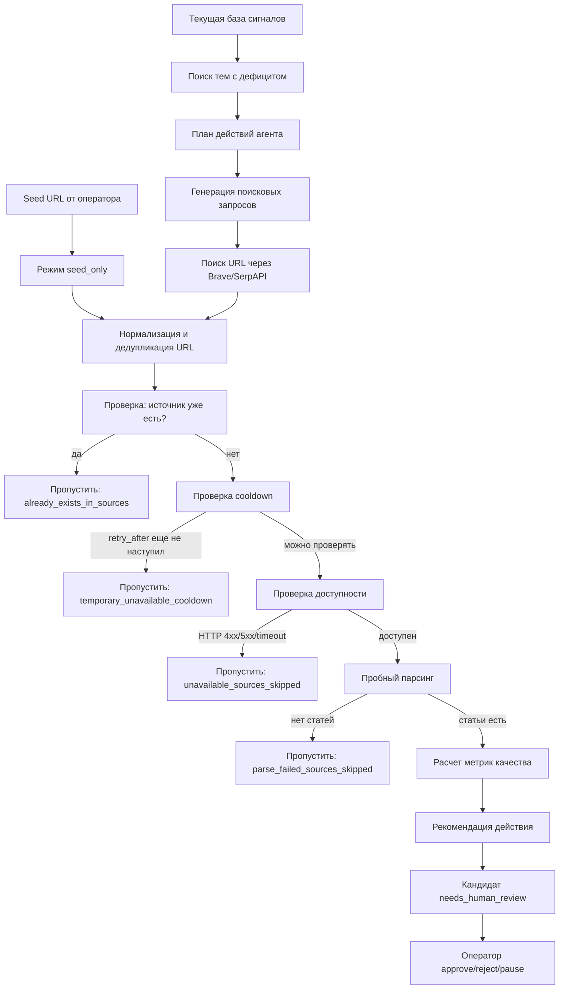

# Пайплайн поиска источников

Этот документ описывает текущую реализацию агента поиска дополнительных источников: как выбираются темы, как генерируются поисковые запросы, как URL превращаются в кандидатов и какие проверки защищают систему от мусора.

## Цель

Агент должен помогать оператору находить новые источники сигналов, но не должен сам добавлять источник в боевой каталог.

Основной принцип:

- агент ищет и проверяет кандидатов;
- система сохраняет метрики и причины решений;
- человек утверждает добавление источника;
- после утверждения источник попадает в `sources` и начинает работать через обычный пайплайн сбора.

## Общая схема



## Основные точки входа

| Точка входа | Где используется | Что делает |
|---|---|---|
| `discover_sources()` | ядро агента | один проход поиска кандидатов по теме или seed-url |
| `run_agent_loop()` | автоматический цикл | строит план, выбирает темы, запускает `discover_sources()` |
| `POST /api/source-discovery/discover` | UI, ручной seed-url | проверяет один URL, введенный оператором |
| `POST /api/source-discovery/loop/enqueue` | UI | ставит agent loop в очередь |
| `enqueue-agent-loop` | CLI | ставит agent loop в очередь с консоли |
| `discover-sources` | CLI | ручной запуск одного прохода |

## Этап 1. Выбор темы

Автоматический loop начинает с планировщика.

Функции:

- `get_topic_gaps()`;
- `build_plan()`;
- `run_agent_loop()`.

Логика:

1. Система смотрит, какие темы за период дают мало сигналов.
2. Сравнивает фактическое количество сигналов с целевым количеством.
3. Формирует действия типа `discover_sources`.
4. Для автозапуска разрешены только безопасные действия.

Безопасное действие означает: агент может искать и проверять источники, но не может сам включать их в боевой каталог.

## Этап 2. Генерация поисковых запросов

Функция: `generate_search_queries(topic, offline, limit, strategy)`.

На вход:

| Поле | Значение |
|---|---|
| `topic` | тема, например `роботизация бурения` |
| `offline` | использовать только шаблоны без OpenAI |
| `limit` | максимум запросов, сейчас обычно 8 |
| `strategy` | стратегия поиска: `balanced`, `newsroom`, `technical`, `company` |

На выход:

```json
[
  "роботизация бурения нефтегаз новости",
  "роботизация бурения upstream news",
  "роботизация бурения press release oil gas"
]
```

### 2.1. Память запросов

Перед генерацией агент читает `agent_memory`:

- `memory_type=query`, `status=active` - успешные прошлые запросы;
- `memory_type=query`, `status=muted` - запросы, которые раньше дали пустой результат.

Правила:

1. Успешные запросы ставятся в начало списка.
2. Muted-запросы исключаются.
3. Память фильтруется по текущей теме.

Это нужно, чтобы агент не повторял заведомо пустые поисковые фразы и переиспользовал удачные.

### 2.2. Offline-режим

Если `offline=true`, OpenAI не вызывается. Запросы строятся по шаблонам.

Базовая стратегия `balanced`:

```text
{topic} нефтегаз новости
{topic} нефтесервис пресс-релиз
{topic} технологии добычи нефти
{topic} upstream news
{topic} oilfield technology news
{topic} press release oil gas
{topic} drilling production technology
{topic} energy industry newsroom
```

Стратегия `newsroom` добавляет запросы на пресс-центры:

```text
{topic} newsroom press release oil gas
{topic} media center upstream company
{topic} новости компании нефтегаз
{topic} пресс-релиз нефтесервис
```

Стратегия `technical` добавляет технические источники:

```text
{topic} technology case study oilfield
{topic} technical paper upstream
{topic} SPE drilling production technology
{topic} patent oil gas technology
```

Стратегия `company` ищет поставщиков и нефтесервис:

```text
{topic} vendor oilfield solution
{topic} service company launch
{topic} нефтесервис технология компания
{topic} industrial supplier oil gas news
```

### 2.3. AI-режим

Если `offline=false`, агент вызывает OpenAI через текущий AI-клиент.

Промпт просит:

- искать источники новостей, а не одну случайную статью;
- давать часть запросов на русском и часть на английском;
- добавлять слова `news`, `newsroom`, `press release`, `technology`, `oilfield`, `upstream`, если уместно;
- не делать слишком общие запросы;
- вернуть JSON по схеме.

После ответа OpenAI агент все равно добавляет offline-шаблоны как fallback. Это защищает запуск от ситуации, когда модель вернула слишком мало запросов.

### 2.4. Финальная сборка списка

Функция `_merge_queries()`:

- убирает пустые строки;
- убирает дубли;
- убирает muted-запросы;
- сохраняет порядок;
- режет список по `limit`.

Итоговый порядок:

1. сохраненные успешные запросы из памяти;
2. AI-запросы, если включен AI-режим;
3. offline-шаблоны как fallback.

## Этап 3. Поиск URL

Функция: `search_web()`.

Поддерживаемые провайдеры:

| Provider | Env | Назначение |
|---|---|---|
| `none` | `SOURCE_DISCOVERY_SEARCH_PROVIDER=none` | поиск выключен |
| `brave` | `BRAVE_SEARCH_API_KEY` | Brave Search API |
| `serpapi` | `SERPAPI_API_KEY` | Google results через SerpAPI |

Если поиск выключен, агент возвращает статус `not_configured` и не создает URL из внешней выдачи.

## Этап 4. Seed URL

Seed URL - это URL, который оператор вставил руками на странице агента.

Если `seed_urls` не пустой:

- web search пропускается;
- статус поиска становится `seed_only`;
- кандидаты строятся только из seed URL;
- запросы все равно генерируются для логов и памяти, но не используются для выдачи.

Это важно, чтобы при проверке одного конкретного источника агент не создавал рядом случайные кандидаты из поисковых шаблонов.

## Этап 5. Нормализация и дедупликация URL

Функция: `_candidate_urls()`.

Что нормализуется:

- если схемы нет, добавляется `https://`;
- схема и host приводятся к нижнему регистру;
- `#fragment` удаляется;
- хвостовой `/` убирается, кроме корня сайта;
- URL используется как стабильный ключ дедупликации.

Примеры:

| Вход | Нормализованный URL |
|---|---|
| `example.com/news/#top` | `https://example.com/news` |
| `https://EXAMPLE.com/news/` | `https://example.com/news` |
| `https://example.com/` | `https://example.com/` |

## Этап 6. Quality gates

Quality gates отсекают URL, которые технически могут быть доступны, но почти наверняка не являются хорошей точкой входа источника.

### 6.1. URL gates

Срабатывают до HTTP-запроса.

Отсекаются:

- документы и архивы: `.pdf`, `.doc`, `.docx`, `.xls`, `.xlsx`, `.ppt`, `.pptx`, `.zip`, `.rar`, `.7z`;
- индексный шум: `/tag/`, `/tags/`, `/author/`, `/authors/`, `/search`;
- одиночные статьи вместо раздела источника.

Примеры причин:

```json
{
  "quality_gate_sources_skipped": [
    {
      "url": "https://example.com/tag/drilling",
      "domain": "example.com",
      "reason": "bad_url_type:index_noise",
      "stage": "url"
    },
    {
      "url": "https://example.com/news/2026/robotic-drilling-system-improves-oilfield-operations",
      "domain": "example.com",
      "reason": "single_article_url",
      "stage": "url"
    }
  ]
}
```

### 6.2. Content gates

Срабатывают после `fetch_inspection`, если страница вернула HTML.

Отсекаются:

- semantic 404: HTTP `200`, но внутри текст `page not found`, `page does not exist`, `страница не найдена`, `ошибка 404`;
- anti-bot/challenge: `Cloudflare`, `cf-challenge`, `captcha`, `access denied`, `enable javascript`, `подтвердите, что вы человек`.

Пример:

```json
{
  "quality_gate_sources_skipped": [
    {
      "url": "https://example.com/news",
      "domain": "example.com",
      "reason": "anti_bot",
      "stage": "content"
    }
  ]
}
```

Quality gates не заменяют пробный парсинг. Они только убирают очевидно плохие входы до дорогой проверки.

## Этап 7. Отсев уже существующих источников

Функция: `source_inventory_index()`.

Агент строит индекс текущей таблицы `sources`:

- по `url`;
- по `rss_url`;
- по `listing_url`;
- по домену.

Если кандидат совпал с существующим источником, он не создается.

Результат попадает в:

```json
{
  "existing_sources_skipped": [
    {
      "url": "https://www.slb.com/news-and-insights",
      "domain": "slb.com",
      "source_id": 22,
      "source_name": "SLB (Schlumberger)",
      "reason": "already_exists_in_sources"
    }
  ]
}
```

## Этап 8. Отсев запрещенных доменов

Агент читает `agent_memory`:

- `memory_type=domain`;
- `status=rejected`.

Если домен найден в rejected-memory, URL пропускается. Это ручной blacklist для оператора.

Особенность: seed URL оператора не отсекается rejected-memory на этапе `_candidate_urls()`, чтобы человек мог принудительно перепроверить домен.

## Этап 9. Retry/cooldown для временно недоступных доменов

Если источник дал timeout или `5xx`, агент не должен проверять его снова в каждом запуске.

Логика:

1. При временной ошибке агент пишет `agent_memory`:
   - `memory_type=domain`;
   - `status=temporary_unavailable`;
   - `subject=<domain>`;
   - `facts.failure_count`;
   - `facts.retry_after`;
   - `facts.last_reason`;
   - `facts.last_probe`.
2. Пока `retry_after` не наступил, домен пропускается до HTTP-запроса в автоматическом поиске.
3. После нескольких подряд временных ошибок домен переводится в `rejected`.

Seed URL от оператора обходит cooldown, чтобы человек мог принудительно перепроверить временно недоступный источник.

Текущие параметры:

| Параметр | Значение |
|---|---|
| cooldown | 24 часа |
| reject threshold | 3 временные ошибки |

Пример пропуска:

```json
{
  "cooldown_sources_skipped": [
    {
      "url": "https://flaky.example.com/news",
      "domain": "flaky.example.com",
      "reason": "temporary_unavailable_cooldown",
      "retry_after": "2026-08-24T10:00:00+00:00",
      "failure_count": 2,
      "last_reason": "http_502"
    }
  ]
}
```

Permanent-ошибки вроде `403`, `404`, `410`, `451` сразу пишутся как `rejected`, потому что обычно это не временная недоступность.

## Этап 10. Проверка доступности

Функция: `inspect_source(url, fetch=True)`.

Если включен `fetch_inspection`, агент делает HTTP probe и сохраняет:

- status;
- размер ответа;
- время ответа;
- ошибку, если она была;
- признаки RSS;
- признаки страницы новостей.

Отсев выполняет `_inspection_skip_reason()`.

Пропускаются:

- любые `5xx`;
- `401`;
- `403`;
- `404`;
- `410`;
- `451`;
- timeout;
- fetch error;
- отсутствие статуса.

Результат попадает в:

```json
{
  "unavailable_sources_skipped": [
    {
      "url": "https://burneft.ru/",
      "domain": "burneft.ru",
      "reason": "http_502"
    }
  ]
}
```

## Этап 11. Пробный парсинг

Функция: `test_parse_source(url, article_limit=5)`.

Пробный парсинг не пишет статьи в основной поток. Он только проверяет, можно ли из кандидата извлечь материалы.

Логика:

1. Скачать listing page.
2. Извлечь ссылки на возможные статьи.
3. Скачать несколько статей.
4. Извлечь заголовок, дату и текст.
5. Прогнать локальный prefilter.
6. Посчитать тестовые метрики.

Метрики:

| Метрика | Что значит |
|---|---|
| `tested_articles` | сколько материалов нашли и положили в песочницу |
| `parsed_articles` | у скольких материалов удалось извлечь текст |
| `kept_by_prefilter` | сколько материалов прошло быстрый локальный фильтр |
| `processed_articles` | сколько материалов прошло AI-проверку или было явно отклонено |
| `relevant_articles` | сколько материалов AI признал релевантными |
| `scored_articles` | сколько материалов получило score |
| `high_score_articles` | сколько материалов получило score `50+` |
| `avg_score` | средний score по оцененным материалам |
| `duplicate_count` | сколько дублей встретилось |
| `noise_count` | сколько материалов похоже на шум |

Пропускаются результаты:

- `listing_fetch_failed`;
- `no_candidates`.

Результат попадает в:

```json
{
  "parse_failed_sources_skipped": [
    {
      "url": "https://oil.rftoday.ru/",
      "domain": "oil.rftoday.ru",
      "reason": "no_candidates",
      "verdict": "no_candidates"
    }
  ]
}
```

## Этап 12. Рекомендация действия

Функция: `recommend_source_action()`.

Оценка двухслойная.

Первый слой - прозрачные правила по метрикам. Он всегда доступен и используется как fallback.

Quality score считается по реальной воронке материалов:

- доля материалов, которые удалось обработать;
- доля релевантных материалов;
- доля материалов со score `50+`;
- средний score;
- штрафы за шум и дубли.

Если `offline=true`, решение считается только по правилам:

| Условие | Действие |
|---|---|
| материалов не проверяли | `human_review` |
| качество высокое | `add` |
| качество среднее | `test_more` |
| качество низкое | `reject` |
| неоднозначно | `human_review` |

Если `offline=false`, включается второй слой: AI получает не только агрегированные метрики, но и компактные доказательства по материалам кандидата.

В evidence попадает:

- заголовок;
- URL;
- релевантность;
- причина релевантности или prefilter;
- краткая суть;
- тег;
- score и label;
- объяснение score;
- статус обработки;
- размер текста.

AI возвращает:

- `recommended_action`;
- `reason`;
- `strengths`;
- `risks`;
- `confidence`.

Результат сохраняется в `review_comment` кандидата и в `agent_actions.output_payload`. Это дает оператору не только рекомендацию, но и объяснение, почему источник полезен или рискован.

Правило безопасности: модель оценивает только переданные факты и не должна придумывать стабильность источника, если проверено мало материалов.

## Этап 13. Создание кандидата

Если источник прошел проверки, создается запись в `source_candidates`.

Статус:

```text
needs_human_review
```

Сохраняется:

- URL;
- домен;
- имя;
- тип кандидата;
- тема;
- confidence;
- тестовые метрики;
- рекомендация;
- причина рекомендации;
- inspection;
- test_parse.

Источник не попадает в `sources`, пока оператор не нажмет approve.

## Этап 14. Agent loop

Функция: `run_agent_loop()`.

Loop делает несколько итераций:

1. Проверяет суточные бюджеты.
2. Строит план действий.
3. Берет только действия с `policy_decision=auto`.
4. Выбирает стратегию запросов.
5. Запускает `discover_sources()`.
6. При необходимости ставит кандидатов на оценку.
7. Записывает наблюдения.
8. Обновляет память стратегий.

План действий теперь содержит `memory_explanation` для действий `discover_sources`.

В нем видно:

- какие запросы агент взял из памяти;
- какие связки `тема + запрос + домен` усиливают действие;
- какие связки будут исключены как плохие;
- какая ручная обратная связь по теме повлияла на приоритет.

Это нужно для отладки: оператор видит, почему агент выбрал тему и какие прошлые решения повлияли на следующий поиск.

Loop останавливается, если:

- достигнут лимит итераций;
- нет автоматических действий;
- несколько итераций не дали кандидатов;
- достигнут суточный бюджет;
- не удалось прочитать usage-бюджет.

## Память агента

Используется таблица `agent_memory`.

| Тип памяти | Что хранит |
|---|---|
| `query` | поисковые запросы, которые были полезны или пусты |
| `strategy` | эффективность стратегий по теме |
| `domain` | ручные правила по доменам |
| `topic` | ручные правила по темам |
| `topic_query_domain` | связка темы, поискового запроса и домена |
| `source` | выводы по конкретным существующим источникам |

Как обновляется query-memory:

- если поиск успешен и запрос ничего не дал, запрос может стать `muted`;
- если запрос привел к кандидатам, сохраняется как `active`;
- сохраняются `found_candidates`, `tested_articles`, `relevant_articles`, `avg_score`, `empty_result`.

Как память применяется при новом поиске:

- успешные `query` и `topic_query_domain` подмешиваются в начало списка поисковых запросов;
- `muted` query исключаются из генерации;
- плохая связка `topic + query + domain` исключает конкретный результат поиска;
- хорошая связка `topic + query + domain` поднимает результат выше в очереди проверки;
- score домена и score запроса дают дополнительный вес при сортировке результатов.

Это не заменяет quality gates. Даже если память подняла результат выше, URL всё равно проходит проверки на существующий источник, cooldown, semantic 404, anti-bot и плохой тип URL.

Как обновляется domain-memory для временно недоступных источников:

- `temporary_unavailable` ставится при timeout/fetch failed/`5xx`;
- `retry_after` ограничивает повторные проверки;
- `failure_count` растет при повторных ошибках;
- после порога ошибок статус становится `rejected`;
- `rejected` домены исключаются из обычного поиска.

Как обновляется source-memory:

- ключ памяти: `source:<source_id>`;
- стабильный источник получает `status=active`;
- источник с проблемами получает `status=muted`;
- в `facts_json` сохраняются `source_id`, recommendation, причины, quality score, шум, дубли, parser/network поля.

Что агент считает проблемой источника:

- за период нет сигналов;
- много шума;
- много дублей;
- низкий средний score;
- проблемный RU/External доступ;
- статьи находятся, но не обрабатываются, значит вероятно нужен другой парсер.

Какие рекомендации пишет агент:

- `increase_frequency` - проверять чаще;
- `decrease_frequency_or_pause` - проверять реже или поставить на паузу;
- `try_playwright_parser` - сменить стратегию парсинга;
- `diagnose_or_pause` - отправить на диагностику или поставить на паузу;
- `diagnose_network` - отправить на сетевую диагностику;
- `move_to_external_region` - перенести в external-worker.

Для таких случаев план создает action `audit_existing_source`. Это действие не меняет источник автоматически: оператор должен открыть источник и решить, что делать.

В UI на странице агента есть блок `Источники под наблюдением`. Он строится из `agent_memory` типа `source` и показывает источник, проблему, рекомендацию, причину и ссылку на экран источников.

Для корректности решения audit action также содержит:

- `problem_type` - тип проблемы: `stale`, `noisy`, `duplicating`, `low_score`, `needs_external`, `broken`, `parser_suspect`;
- `severity` - серьёзность: `low`, `medium`, `high`, `critical`;
- `confidence` - уверенность: `low`, `medium`, `high`;
- `decision_log.triggered_rules` - правила, которые сработали;
- `decision_log.suppressed_rules` - правила, которые были подавлены более важным признаком.

Правила приоритета:

- сетевой блокер важнее подозрения на парсер;
- external-блокер важнее обычного качества;
- полезный источник с digest-сигналами нельзя агрессивно отключать;
- маленькая выборка снижает confidence.

## Agent Evaluation Report

Endpoint: `/api/source-discovery/evaluation`.

Отчёт нужен, чтобы оценивать качество самого агента.

Он показывает:

- сколько рекомендаций по кандидатам уже получили решение оператора;
- какая доля рекомендаций совпала с решением оператора;
- какие рекомендации по источникам встречаются чаще всего;
- какие типы проблем источников встречаются чаще всего;
- какие правила часто подавляются или срабатывают с низкой уверенностью;
- сколько learning-событий есть в последних действиях агента.

В UI отчёт отображается на странице агента в блоке `Качество агента`.

## Learning loop по обратной связи

Функция: `apply_candidate_learning()`.

Агент обновляет память не только во время поиска, но и после фактических решений оператора и результата песочницы.

### Когда срабатывает обучение

| Событие | Что обновляется |
|---|---|
| Оператор одобрил кандидата | домен, тема, поисковый запрос, стратегия |
| Оператор отклонил как шум | домен, тема, поисковый запрос, стратегия получают штраф |
| Оператор отклонил как дубликат | штрафуются домен, URL/запрос и стратегия, но тема не штрафуется |
| Песочница нашла хорошие статьи | домен, тема, запрос и стратегия получают небольшой плюс |
| Песочница не нашла релевантных статей | домен, тема, запрос и стратегия получают небольшой минус |

Дополнительно всегда обновляется память `topic_query_domain`, если известны все три части:

```text
тема | поисковый запрос | домен
```

Это нужно, чтобы агент не делал слишком грубые выводы. Например, домен может быть полезен для цифровизации, но бесполезен для бурения. Или запрос может хорошо работать только на конкретной группе сайтов.

### Что сохраняется по реальным статьям

В `facts_json.metrics` и `facts_json.quality_funnel` сохраняется воронка:

| Поле | Что показывает |
|---|---|
| `found` | сколько материалов нашли |
| `parsed` | сколько материалов удалось разобрать |
| `prefilter_kept` | сколько прошло быстрый фильтр |
| `processed` | сколько дошло до AI-обработки или явного отклонения |
| `relevant` | сколько признано релевантными |
| `scored` | сколько получило score |
| `score_50_plus` | сколько материалов имеет score `50+` |
| `noise` | сколько ушло в шум |
| `duplicates` | сколько дублей найдено |

Так агент учится не по внешнему виду сайта, а по фактической пользе источника для базы сигналов.

### Как определяется происхождение кандидата

При создании кандидата агент пишет в `agent_actions`:

- `candidate_id`;
- `discovery_query`;
- `query_strategy`;
- `topic`;
- URL и домен.

Learning loop читает последнюю action-запись `create_source_candidate` и понимает, какой запрос и какая стратегия привели к кандидату.

### Как меняется score

Score хранится в `agent_memory.score` и накапливается в диапазоне от `-100` до `100`.

Примерные правила:

| Решение | Domain | Topic | Query | Strategy | Topic+Query+Domain |
|---|---:|---:|---:|---:|---:|
| approve | +30 | +18 | +24 | +18 | +30 |
| sandbox positive | +12..+22 | +8 | +12..+22 | +8 | +12..+22 |
| reject duplicate | -12 | 0 | -10 | -6 | -12 |
| reject noise | -25 | -8 | -20 | -10 | -25 |
| reject general | -18 | -5 | -14 | -8 | -18 |
| sandbox negative | -12 | -4 | -10 | -5 | -12 |

Каждое изменение добавляет запись в `facts.events`, чтобы можно было восстановить, почему score вырос или упал.

### Важное правило

Дубликат не должен портить тему. Если найденный источник оказался дублем уже существующего, это проблема домена/URL/запроса, но не признак того, что тема плохая.

## Текущие ограничения

1. Semantic 404 пока ловится косвенно через `no_candidates`, но не отдельным детектором текста.
2. Cloudflare/captcha/challenge пока не имеют отдельной причины отсева.
3. Поддомены считаются отдельными доменами, кроме случая точного совпадения через `sources`.
4. RSS/sitemap fallback перед `no_candidates` пока не реализован.
5. Пробный score не равен полноценному AI-score основного пайплайна.
6. Агент не делает автоматический approve источника, это намеренное ограничение безопасности.

## Практические команды

Проверить один seed URL без записи в БД:

```bash
docker compose run --rm app python -m oiltech_digest.cli discover-sources \
  "цифровизация бурения" \
  --seed-url "https://example.com/news" \
  --offline \
  --dry-run \
  --fetch-inspection \
  --test-parse \
  --json
```

Запустить автоматический loop:

```bash
docker compose run --rm app python -m oiltech_digest.cli agent-loop \
  --offline \
  --fetch-inspection \
  --test-parse \
  --max-iterations 3 \
  --candidate-limit 10
```

Поставить loop в очередь:

```bash
docker compose run --rm app python -m oiltech_digest.cli enqueue-agent-loop \
  --offline \
  --fetch-inspection \
  --test-parse
```
