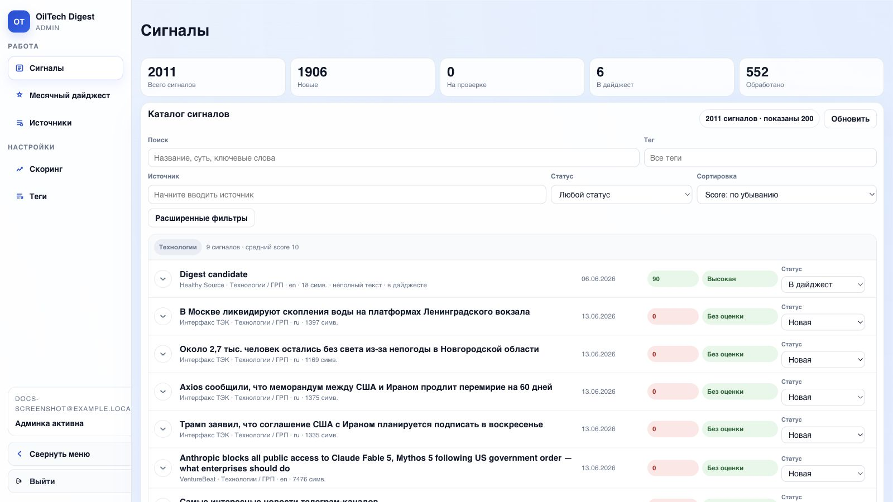
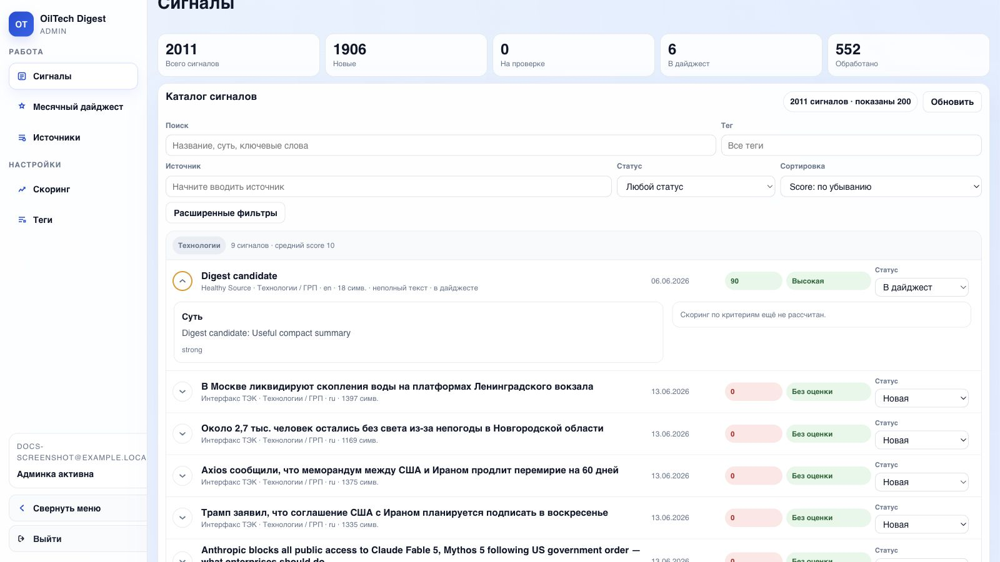
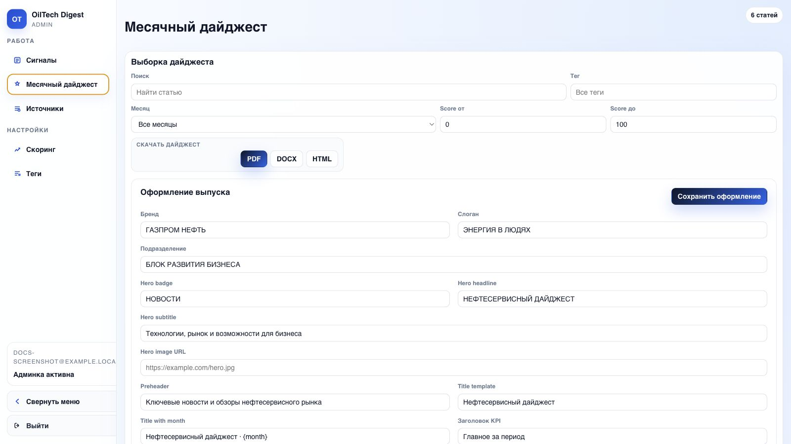
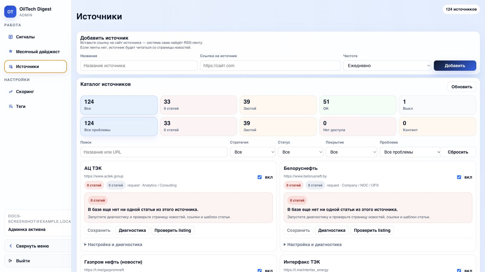
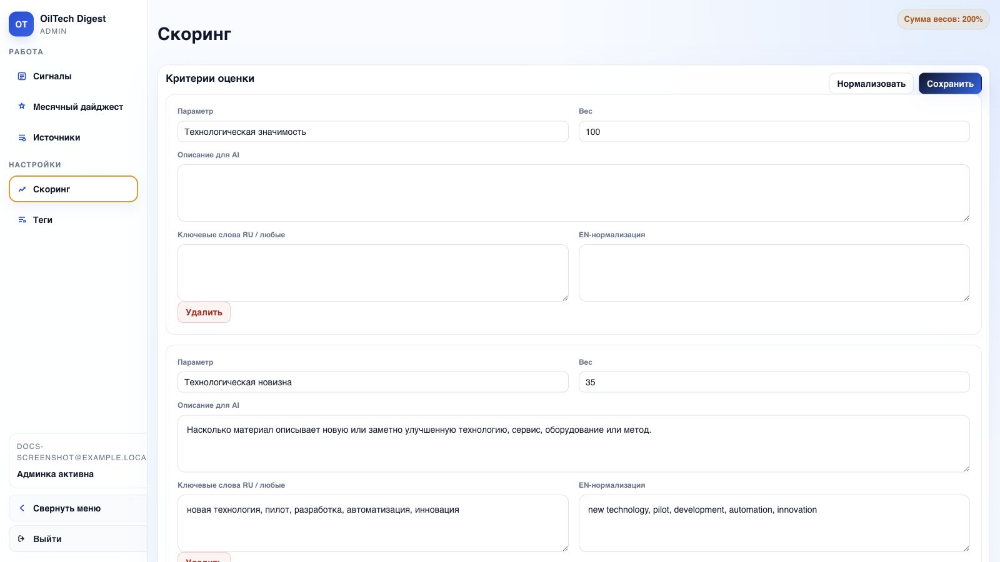
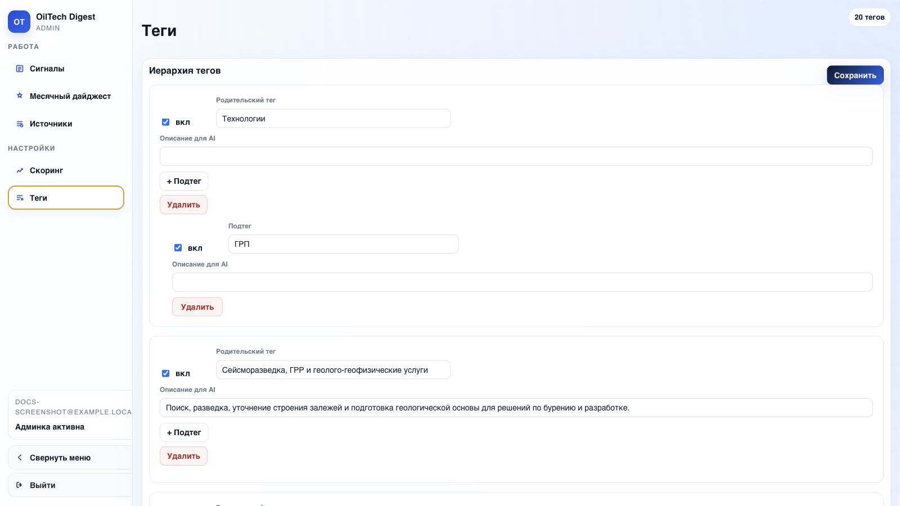

# Документация пользователя

Эта инструкция написана для человека, который впервые открыл OilTech Digest и должен самостоятельно понять, где что находится, как работать с сигналами, как собрать дайджест и что делать, если результат выглядит странно.

OilTech Digest собирает материалы из источников, обрабатывает их AI pipeline, присваивает теги, считает score и помогает собрать месячный дайджест.

## Быстрый старт

Если нужно просто начать работу без чтения всей документации:

1. Откройте админку.
2. Войдите в аккаунт или зарегистрируйтесь.
3. Перейдите в раздел **Сигналы**.
4. Отсортируйте список по `Score: по убыванию`.
5. Выберите нужный тег или источник.
6. Раскройте интересный сигнал стрелкой слева от заголовка.
7. Проверьте AI-суть, тег, score и ссылку на оригинал.
8. Если материал нужен в выпуск, поставьте статус **В дайджест**.
9. Перейдите в **Месячный дайджест**.
10. Проверьте список материалов и экспортируйте PDF или Word.

!!! tip "Самый частый сценарий"
    Обычно работа идет так: `Сигналы -> фильтры -> раскрыть карточку -> поставить В дайджест -> Месячный дайджест -> PDF/Word`.

## Основные понятия

| Термин | Что означает |
|---|---|
| Сигнал | Найденная статья, новость, пост или аналитический материал |
| Источник | Сайт, RSS-лента, Telegram-канал или другой канал сбора материалов |
| AI-суть | Короткое описание материала, сформированное AI |
| Тег | Тематическое направление материала |
| Score | Оценка важности материала по критериям |
| Статус | Ручная отметка редактора: новая, на проверке, в дайджест, архив |
| Дайджест | Итоговый выпуск из выбранных сигналов |
| Pipeline | Цепочка обработки: текст -> суть -> релевантность -> тег -> score |

## Вход и регистрация

1. Откройте адрес админки.
2. Если аккаунта нет, нажмите **Зарегистрироваться**.
3. Введите email.
4. Введите пароль не короче 8 символов.
5. После регистрации или входа откроется основной экран.

Если после входа снова показывается форма авторизации, обновите страницу. Если проблема повторяется, проверьте, что браузер не блокирует cookies.

## Экран "Сигналы"

Это основной рабочий экран. Здесь находится весь поток найденных материалов.

### Что показывает верхняя панель

| Метрика | Как читать |
|---|---|
| Всего сигналов | Сколько материалов есть в базе |
| Новые | Сколько материалов еще не отсмотрено |
| На проверке | Сколько материалов требуют ручной оценки |
| В дайджест | Сколько материалов уже выбрано в выпуск |
| Обработано | Сколько материалов прошли полный AI pipeline |

### Как искать материал по словам

1. Найдите поле **Поиск**.
2. Введите слово, фразу, название компании, технологию или часть заголовка.
3. Дождитесь обновления списка.
4. Если результатов слишком много, дополнительно выберите тег или источник.

Примеры запросов:

- `бурение`;
- `СПГ`;
- `hydrogen`;
- `Wood Mackenzie`;
- `литий`;
- `AI drilling`.

!!! note "Поиск не обязан быть точным"
    Можно вводить часть слова или фразы. Если не нашли материал по русскому слову, попробуйте английский вариант.

### Как фильтровать по тегам

1. Нажмите поле **Тег**.
2. Начните вводить название направления.
3. Выберите нужный тег из списка.
4. Список сигналов обновится.

Используйте теги, когда нужно смотреть не весь поток, а конкретное направление: бурение, геология, цифровизация, рынок, оборудование, энергетика и другие темы.

### Как фильтровать по источнику

1. Найдите поле **Источник**.
2. Начните вводить название источника.
3. Выберите источник из выпадающего списка.
4. Проверьте найденные сигналы.

Фильтр полезен, если нужно проверить конкретный сайт, Telegram-канал или новостную ленту.

### Как фильтровать по статусу

1. Откройте список **Статус**.
2. Выберите нужное значение.

| Статус | Когда выбирать |
|---|---|
| Любой статус | Показать все материалы |
| Новая | Посмотреть еще не обработанный редактором поток |
| На проверке | Вернуться к спорным материалам |
| В дайджест | Проверить выбранные материалы |
| Архив | Посмотреть отложенные или исключенные материалы |

### Как сортировать

| Сортировка | Когда использовать |
|---|---|
| Score: по убыванию | Когда нужно быстро найти самые важные материалы |
| Score: по возрастанию | Когда нужно проверить слабые или странно оцененные материалы |
| Сначала новые | Когда нужно смотреть свежий поток |

Для подготовки выпуска чаще всего используйте `Score: по убыванию`.

## Карточка сигнала

Сигнал можно смотреть в двух режимах: свернутом и раскрытом.

### Что видно в свернутом виде

В свернутой карточке обычно видно:

- заголовок материала;
- источник;
- тег;
- язык;
- дата публикации;
- score;
- статус;
- короткие признаки обработки.

### Как раскрыть сигнал

1. Найдите нужный материал.
2. Нажмите стрелку слева от заголовка.
3. Карточка раскроется вниз.
4. Повторное нажатие свернет карточку.

### Что проверять в раскрытой карточке

Проверяйте карточку в таком порядке:

1. Прочитайте заголовок.
2. Прочитайте AI-суть.
3. Проверьте тег.
4. Посмотрите score.
5. Если score высокий, прочитайте детализацию.
6. Откройте оригинальный материал, если нужно убедиться в фактах.
7. Поставьте статус.

### Как понять, что материал хороший

Материал обычно стоит добавить в дайджест, если:

- он относится к важной технологии или рынку;
- в нем есть конкретное событие, запуск, контракт, сделка, внедрение или исследование;
- источник выглядит надежным;
- AI-суть понятная и не выглядит мусорной;
- score высокий или средний, но тема важна вручную;
- материал не дублирует уже выбранный сигнал.

Материал обычно не стоит добавлять, если:

- он не относится к теме;
- это короткая проходная новость без значимой сути;
- это дубликат;
- источник сомнительный;
- AI-суть явно не совпадает с заголовком;
- материал устарел для текущего выпуска.

## Статусы сигналов

| Статус | Что значит | Когда ставить |
|---|---|---|
| Новая | Материал еще не отсмотрен | Система ставит по умолчанию |
| На проверке | Материал спорный или требует решения | Если нужно вернуться позже |
| В дайджест | Материал выбран в выпуск | Если сигнал должен попасть в дайджест |
| Архив | Материал не нужен в выпуск | Если материал просмотрен и исключен |

### Как поставить статус "В дайджест"

1. Найдите нужный сигнал.
2. При необходимости раскройте карточку.
3. Найдите поле **Статус**.
4. Выберите **В дайджест**.
5. Проверьте, что карточка сохранила новый статус.

После этого материал появится на странице **Месячный дайджест**.

### Как убрать материал из дайджеста

1. Найдите материал в **Сигналах** или **Месячном дайджесте**.
2. Поменяйте статус с **В дайджест** на **Новая**, **На проверке** или **Архив**.
3. Обновите страницу дайджеста.

## Месячный дайджест

На странице дайджеста собирается выпуск из выбранных сигналов.

### Что делать на этой странице

1. Проверьте, что в списке есть нужные материалы.
2. Используйте поиск по словам, если выпуск большой.
3. Используйте фильтр по тегам, если нужно проверить конкретное направление.
4. Уберите лишние материалы через смену статуса.
5. Сформируйте preview или экспорт.

### Что означает месяц

Месяц нужен, чтобы собрать выпуск за конкретный период. Если выбран режим всех месяцев, система может показать все материалы со статусом **В дайджест**.

Если в выпуске не хватает материалов, проверьте:

- выбран ли правильный месяц;
- есть ли материалы со статусом **В дайджест**;
- не включен ли лишний фильтр по тегу или словам;
- не устарел ли список, попробуйте нажать обновление.

### HTML preview

HTML preview нужен, чтобы быстро посмотреть выпуск в браузере.

Используйте его перед PDF/Word, если нужно проверить:

- порядок материалов;
- заголовки;
- краткие описания;
- теги;
- общее визуальное качество выпуска.

### JSON

JSON нужен для технической проверки структуры выпуска. Обычному редактору он чаще всего не нужен.

### Draft

Draft сохраняет черновик выпуска в базе.

Используйте draft, когда:

- выпуск еще не финальный;
- нужно вернуться к нему позже;
- нужно зафиксировать промежуточную версию.

### PDF

PDF нужен для финальной отправки или просмотра в неизменяемом формате.

Порядок:

1. Проверьте список материалов.
2. Нажмите **PDF**.
3. Дождитесь завершения фоновой задачи.
4. Скачайте файл.
5. Откройте файл и проверьте, что карточки не разрываются некорректно.

### Word/DOCX

Word нужен, если выпуск будут редактировать вручную после генерации.

Используйте Word, если:

- нужно поправить формулировки;
- нужно удалить или переставить блоки вручную;
- нужно отправить файл на согласование в редактируемом виде.

!!! warning "Не нажимайте экспорт много раз подряд"
    PDF/Word могут формироваться дольше обычного. Если нажать кнопку несколько раз, появится несколько фоновых задач.

## Источники

Раздел **Источники** нужен для просмотра и обслуживания каналов сбора.

### Что такое источник

Источник — это место, откуда система берет материалы:

- RSS-лента;
- сайт с новостной страницей;
- Telegram-канал;
- сайт, которому нужен браузерный сбор через Playwright.

### Основные поля источника

| Поле | Что означает |
|---|---|
| Название | Понятное имя источника |
| URL | Основная ссылка |
| RSS URL | Ссылка на RSS, если есть |
| Parse strategy | Способ сбора материалов |
| Listing URL | Страница со списком новостей |
| Enabled | Включен источник или нет |

### Стратегии парсинга

| Стратегия | Что значит |
|---|---|
| `rss` | Сбор из RSS-ленты |
| `request` | Сбор обычным HTTP-запросом со страницы |
| `telegram` | Сбор из Telegram |
| `playwright` | Сбор через браузер, если обычный запрос не подходит |
| `none` | Источник не собирается автоматически |

### Как понять, что с источником проблема

Проблема вероятна, если:

- источник включен, но в базе 0 статей;
- давно не появлялись новые материалы;
- диагностика показывает ошибку;
- сайт открывается в браузере, но система ничего не собирает;
- источник часто блокирует запросы.

Что сделать:

1. Проверьте URL источника.
2. Проверьте RSS URL, если источник RSS.
3. Запустите диагностику, если кнопка доступна.
4. Если источник блокирует обычный сбор, переведите его на `playwright`.
5. Если источник недоступен с российского сервера, нужен внешний контур.

!!! note "Права на изменение источников"
    Если вы не уверены, что менять в источнике, не редактируйте стратегию и URL наугад. Лучше передать ссылку разработчику или администратору.

## Скоринг

Score помогает быстро понять, какие материалы важнее.

### Как читать score

| Score | Интерпретация |
|---|---|
| Высокий | Материал стоит проверить в первую очередь |
| Средний | Материал может быть полезным, зависит от темы |
| Низкий или 0 | Обычно низкий приоритет, но возможны ошибки обработки |

Score не заменяет редакторское решение. Он помогает отсортировать поток, но финальное решение принимает человек.

### Когда можно игнорировать низкий score

Низкий score можно пересмотреть вручную, если:

- источник стратегически важен;
- тема относится к приоритетному направлению;
- заголовок явно важный;
- AI мог не понять материал из-за языка, короткого текста или плохого извлечения.

## Теги

Теги нужны для группировки сигналов по темам.

### Как пользоваться тегами

Используйте теги, чтобы:

- быстро перейти к нужному направлению;
- собрать тематический выпуск;
- проверить, какие материалы попадают в конкретную область;
- найти ошибки AI-тегирования.

### Что делать, если тег неправильный

Если материал явно попал не в тот тег:

1. Откройте карточку сигнала.
2. Проверьте AI-суть и оригинал.
3. Если ошибка подтверждается, зафиксируйте пример.
4. Передайте пример администратору или разработчику для настройки тегов.

## Типовой рабочий процесс редактора

### Ежедневная проверка

1. Откройте **Сигналы**.
2. Выберите сортировку **Сначала новые**.
3. Просмотрите свежие материалы.
4. Сильные материалы переведите в **В дайджест**.
5. Спорные материалы переведите в **На проверке**.
6. Мусорные материалы переведите в **Архив**.

### Подготовка выпуска

1. Откройте **Сигналы**.
2. Выберите `Score: по убыванию`.
3. Пройдитесь по ключевым тегам.
4. Добавьте сильные материалы в дайджест.
5. Откройте **Месячный дайджест**.
6. Проверьте, нет ли дублей.
7. Проверьте баланс тем.
8. Сформируйте HTML preview.
9. Если все нормально, сформируйте PDF или Word.

### Проверка качества выпуска

Перед отправкой проверьте:

- нет ли дублей;
- нет ли нерелевантных материалов;
- нет ли слишком длинных описаний;
- не попали ли материалы не за тот месяц;
- нормально ли отображаются теги;
- открываются ли ссылки на оригиналы;
- PDF/Word сформировался без пустых страниц и сломанных карточек.

## Частые проблемы

### Не вижу нужный материал

Проверьте:

1. Не включен ли фильтр по тегу.
2. Не включен ли фильтр по статусу.
3. Правильно ли введен поисковый запрос.
4. Попробуйте искать по источнику.
5. Попробуйте сортировку **Сначала новые**.

### В дайджесте пусто

Причины:

- нет материалов со статусом **В дайджест**;
- выбран не тот месяц;
- включен лишний фильтр;
- материалы еще не обработаны.

Что сделать:

1. Перейдите в **Сигналы**.
2. Поставьте нескольким материалам статус **В дайджест**.
3. Вернитесь в **Месячный дайджест**.
4. Обновите список.

### PDF или Word долго формируется

Это нормально для больших выпусков.

Что делать:

1. Не нажимайте кнопку повторно сразу.
2. Подождите завершения фоновой задачи.
3. Если файл не появился, обновите страницу.
4. Если проблема повторяется, передайте администратору время запуска и выбранные фильтры.

### AI-суть выглядит странно

Возможные причины:

- источник отдал короткий или поврежденный текст;
- статья была частично недоступна;
- материал на другом языке;
- сайт заблокировал полный текст;
- AI обработал не тот фрагмент.

Что сделать:

1. Откройте оригинал.
2. Сравните оригинал с AI-сутью.
3. Если ошибка критичная, не добавляйте материал в дайджест.
4. Передайте пример администратору.

### Score выглядит неправильным

Score помогает, но не является абсолютной истиной.

Что сделать:

1. Проверьте оригинальный материал.
2. Проверьте детализацию score.
3. Если материал важный, добавьте его вручную несмотря на score.
4. Если ошибка системная, передайте пример для настройки критериев.

### Источник не обновляется

Что проверить:

1. Включен ли источник.
2. Есть ли у источника правильный URL или RSS URL.
3. Не поменялась ли структура сайта.
4. Не блокирует ли сайт запросы.
5. Нужен ли этому источнику Playwright или внешний контур.

## Что передавать администратору при проблеме

Чтобы проблему можно было быстро разобрать, передайте:

- что вы пытались сделать;
- на какой странице возникла проблема;
- какой фильтр был включен;
- ссылку на сигнал или источник;
- примерное время ошибки;
- скриншот, если проблема визуальная;
- что ожидали увидеть;
- что увидели фактически.

## Короткий чеклист перед отправкой дайджеста

- [ ] В выпуске есть все важные материалы.
- [ ] Дубли удалены.
- [ ] Нерелевантные материалы убраны.
- [ ] Теги выглядят корректно.
- [ ] Описания читаются нормально.
- [ ] Ссылки на оригиналы открываются.
- [ ] PDF или Word успешно скачан.
- [ ] Файл открыт и визуально проверен.
