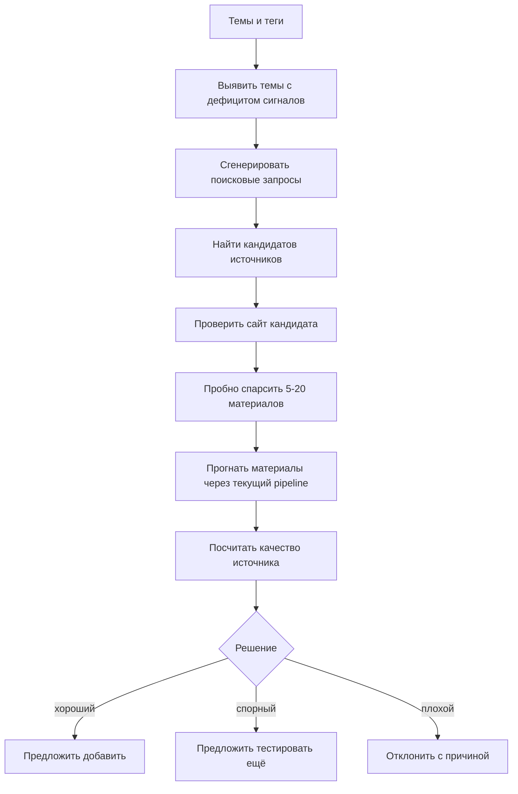
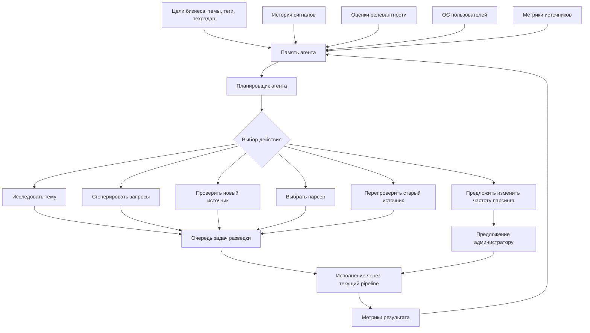

# ТЗ: агент разведки новых источников

Дата: 2026-08-11

## 1. Контекст

OilTech Digest уже умеет собирать сигналы из каталога источников, прогонять их через ИИ-проверку релевантности, формировать суть, тег, оценку и дайджест.

Следующий продуктовый шаг: система должна помогать находить новые источники и сигналы на основе фактического качества текущих источников и обратной связи пользователей.

Важно: на MVP не нужно делать полностью автономного “агента, который сам всё решает”. Нужен управляемый контур разведки:

1. система видит, какие темы дают мало хороших сигналов;
2. агент предлагает новые источники;
3. система пробно парсит найденные источники;
4. текущий pipeline оценивает реальные материалы;
5. администратор принимает решение: добавить, тестировать ещё или отклонить.

## 2. Цель

Сделать MVP системы поиска дополнительных источников, которая:

- находит кандидатов источников по интересующим темам;
- проверяет кандидатов на реальных материалах;
- считает качество источника по фактическим сигналам;
- использует оценки релевантности, скоринг и пользовательскую обратную связь;
- предлагает администратору понятное решение;
- в будущем может стать агентом, который сам выбирает темы, запросы, парсер и источники для перепроверки.

## 3. Не цель MVP

На первом этапе не делаем:

- настоящее дообучение LLM;
- бесконтрольный веб-краулинг;
- автоматическое добавление источников в прод без подтверждения;
- автоматическое удаление источников;
- сложный reinforcement learning;
- многоагентную систему ради самой агентности;
- бесконечный browser-agent, который кликает по сайтам без лимитов.

## 4. Основная идея

Сначала обучаем не модель, а политику поиска и ранжирования:

- какие темы бизнесу важны;
- какие источники дают релевантные сигналы;
- какие источники дают шум;
- какие поисковые запросы приводят к полезным источникам;
- какие сигналы пользователи добавляют в дайджест;
- какие сигналы пользователи помечают как шум или дубликаты.

LLM используется точечно:

- придумать поисковые запросы;
- объяснить, почему источник может быть полезен;
- классифицировать непонятную страницу;
- сформировать рекомендацию по результатам тестового парсинга.

Финальное качество источника считаем прозрачно по метрикам.

## 5. MVP-пайплайн



## 6. Целевой агент поверх pipeline

Позже агент должен стать не “роботом с браузером”, а оркестратором решений.

Он выбирает:

- какие темы исследовать;
- какие поисковые запросы пробовать;
- какой способ парсинга применить;
- какие источники перепроверить;
- какие источники стоит парсить чаще или реже.

Но действия выполняются через ограниченные системные инструменты.



## 7. Инструменты агента

Агент не должен иметь прямой доступ к произвольным действиям. Ему выдаётся набор инструментов.

### 7.1. `get_topic_gaps`

Находит темы, по которым мало хороших сигналов.

Пример результата:

```json
{
  "topic": "роботизация бурения",
  "signals_30d": 3,
  "target_signals_30d": 15,
  "gap": 12,
  "priority": 82
}
```

### 7.2. `generate_search_queries`

Генерирует поисковые запросы по теме.

Пример:

```json
{
  "topic": "роботизация бурения",
  "queries": [
    "robotic drilling rig oilfield press release",
    "autonomous drilling system upstream news",
    "буровая роботизация нефтегаз пресс-релиз"
  ]
}
```

### 7.3. `search_web`

Ищет кандидатов источников по запросам. На MVP можно сделать через поисковый API или ручной адаптер.

Результат:

```json
{
  "query": "autonomous drilling system upstream news",
  "results": [
    {
      "url": "https://example.com/news",
      "title": "Example Newsroom",
      "snippet": "News about drilling automation..."
    }
  ]
}
```

### 7.4. `inspect_source`

Проверяет страницу кандидата:

- это источник или отдельная статья;
- есть ли раздел новостей;
- есть ли RSS;
- нужна ли браузерная отрисовка;
- есть ли пагинация;
- видны ли даты;
- похож ли сайт на пресс-центр, медиа, блог или каталог.

### 7.5. `test_parse_source`

Пробно вытаскивает 5-20 материалов из кандидата.

Важно: материалы кандидата на MVP лучше хранить отдельно или помечать как тестовые, чтобы они не загрязняли основной поток без решения администратора.

### 7.6. `score_source_candidate`

Считает качество кандидата по реальным материалам:

- сколько материалов найдено;
- сколько успешно извлечено;
- сколько дошло до ИИ-проверки;
- сколько признано релевантными;
- средняя оценка;
- доля дублей;
- доля шума;
- стоимость обработки;
- какие темы покрывает.

### 7.7. `recommend_source_action`

Формирует рекомендацию:

- `add` — добавить источник;
- `test_more` — тестировать ещё;
- `reject` — отклонить;
- `human_review` — нужна ручная проверка.

Рекомендация должна опираться на факты, а не только на текстовое объяснение.

Пример:

```json
{
  "source": "SLB Newsroom",
  "tested_articles": 12,
  "relevant_articles": 9,
  "avg_score": 71,
  "duplicates": 1,
  "noise": 2,
  "recommendation": "add",
  "reason": "Источник регулярно публикует релевантные новости по бурению и цифровым нефтесервисным технологиям."
}
```

### 7.8. `recommend_schedule_change`

Позже: предлагает чаще или реже парсить существующий источник.

Примеры:

- хороший источник: увеличить частоту;
- шумный источник: снизить частоту;
- источник не обновляется: поставить на паузу;
- источник часто ломается: отправить на диагностику.

## 8. Память агента

Память делится на несколько уровней.

### 8.1. Память тем

Хранит:

- название темы;
- связь с тегами;
- бизнес-важность;
- целевое количество сигналов;
- текущее количество сигналов;
- дефицит сигналов;
- хорошие ключевые слова;
- плохие ключевые слова.

Пример тем:

- бурение;
- заканчивание скважин;
- роботизация;
- цифровые двойники;
- ГРП;
- импортозамещение;
- промышленный ИИ;
- новые материалы;
- подводные технологии.

### 8.2. Память источников

Хранит:

- сколько сигналов даёт источник;
- долю релевантных сигналов;
- среднюю оценку;
- долю дублей;
- долю шума;
- какие темы покрывает;
- как часто обновляется;
- какой парсер работает лучше;
- нужен ли внешний сервер;
- сколько стоит обработка одного полезного сигнала.

### 8.3. Память поисковых запросов

Хранит:

- текст запроса;
- тему;
- дату запуска;
- сколько кандидатов найдено;
- сколько кандидатов оказалось полезными;
- какие домены уже проверялись;
- какие запросы дали мусор.

### 8.4. Память пользовательской обратной связи

Хранит события:

- сигнал добавлен в дайджест;
- сигнал помечен как шум;
- сигнал помечен как дубликат;
- исправлен тег;
- изменён статус;
- изменена оценка;
- добавлен комментарий аналитика.

Важно хранить именно события, а не только финальный статус. Тогда можно анализировать динамику и качество решений.

## 9. Метрики качества

### 9.1. Приоритет темы

Пример прозрачной формулы:

```text
приоритет темы =
  бизнес-важность * 0.4
  + дефицит сигналов * 0.3
  + интерес пользователей * 0.2
  + дефицит источников * 0.1
```

### 9.2. Качество источника

Пример прозрачной формулы:

```text
качество источника =
  доля релевантных * 0.35
  + средняя оценка * 0.25
  + доля попаданий в дайджест * 0.25
  - доля дублей * 0.10
  - доля шума * 0.05
```

Формулы нужны не как окончательная истина, а как объяснимый старт. Позже веса можно калибровать на реальных данных.

## 10. Статусы кандидата источника

```text
new                 новый кандидат
researching         агент изучает источник
test_parsing        идёт пробный парсинг
needs_human_review  нужна ручная проверка
approved            источник одобрен
rejected            источник отклонён
paused              источник отложен
```

## 11. Статусы агентной задачи

```text
planned             задача запланирована
running             выполняется
waiting_for_review  ждёт решения администратора
done                завершена
failed              завершилась ошибкой
cancelled           отменена
```

## 12. Предлагаемые таблицы

### 12.1. MVP

Минимальный набор:

```text
source_candidates
agent_tasks
agent_actions
agent_memory
source_quality_snapshots
signal_feedback_events
```

### 12.2. Целевой набор

Расширенный набор:

```text
source_candidates
agent_tasks
agent_actions
agent_memory
topic_profiles
search_query_experiments
source_quality_snapshots
signal_feedback_events
```

## 13. Черновая структура таблиц

### 13.1. `signal_feedback_events`

Назначение: хранить пользовательскую обратную связь по сигналам.

Поля:

```text
id
article_id
user_id
event_type
old_value
new_value
comment
created_at
```

Примеры `event_type`:

```text
added_to_digest
marked_noise
marked_duplicate
tag_changed
score_changed
status_changed
comment_added
```

### 13.2. `source_quality_snapshots`

Назначение: хранить срез качества источника на дату.

Поля:

```text
id
source_id
period_from
period_to
articles_found
articles_processed
relevant_count
rejected_count
avg_score
digest_count
duplicate_count
noise_count
processing_cost_usd
quality_score
created_at
```

### 13.3. `source_candidates`

Назначение: хранить найденные агентом источники-кандидаты.

Поля:

```text
id
url
normalized_domain
name
candidate_type
status
discovered_by
discovery_reason
topic
expected_tags_json
confidence
tested_articles
relevant_articles
avg_score
duplicate_count
noise_count
recommended_action
review_comment
approved_source_id
created_at
updated_at
```

### 13.4. `agent_tasks`

Назначение: хранить задачи агента.

Поля:

```text
id
kind
status
topic
payload_json
result_json
budget_json
error_message
started_at
finished_at
created_at
```

Примеры `kind`:

```text
discover_sources
test_source_candidate
recheck_source_quality
recommend_schedule_changes
```

### 13.5. `agent_actions`

Назначение: аудит действий агента.

Поля:

```text
id
task_id
action_type
input_json
output_json
cost_usd
duration_ms
created_at
```

## 14. Ограничения безопасности

Агенту запрещено без ручного подтверждения:

- добавлять источник в активный каталог;
- удалять источник;
- менять расписание парсинга;
- включать внешний контур для источника;
- тратить бюджет выше лимита;
- запускать бесконечный обход сайта;
- обходить авторизацию, paywall или запреты сайта.

Рекомендуемые лимиты MVP:

```text
max_queries_per_run = 10
max_candidates_per_topic = 30
max_pages_per_source = 20
max_test_articles_per_source = 10
max_ai_cost_per_run_usd = 2
requires_approval_for_activation = true
```

## 15. Как это должно выглядеть в интерфейсе

Новый раздел: **Разведка источников**.

Блоки:

1. Темы с дефицитом.
2. Активные задачи агента.
3. Найденные кандидаты источников.
4. Результаты пробного парсинга.
5. Рекомендации для администратора.
6. История решений.

Пример карточки кандидата:

```text
SLB Newsroom
Тема: роботизация / цифровизация
Проверено материалов: 12
Релевантных: 9
Средняя оценка: 71
Дубликатов: 1
Шума: 2
Рекомендация: добавить

[Добавить источник] [Тестировать ещё] [Отклонить]
```

## 16. Этапы внедрения

### Этап 1. Обратная связь и метрики

Задачи:

- добавить `signal_feedback_events`;
- писать события при смене статуса сигнала;
- писать события при добавлении в дайджест;
- считать качество источников;
- добавить `source_quality_snapshots`.

Результат:

- понятно, какие источники дают пользу;
- понятно, какие темы недопокрыты;
- появляется база для агента.

### Этап 2. Кандидаты источников

Задачи:

- добавить `source_candidates`;
- добавить команду ручного создания кандидата;
- добавить команду пробного парсинга кандидата;
- сохранять результаты проверки;
- добавить статусную модель кандидата.

Результат:

- новые источники можно проверять безопасно, не загрязняя основной каталог.

### Этап 3. MVP агента разведки

Задачи:

- добавить `agent_tasks`;
- добавить `agent_actions`;
- сделать команду:

```bash
python -m oiltech_digest.cli discover-sources --topic "роботизация бурения" --limit 20
```

- агент генерирует запросы;
- поиск возвращает URL;
- система создаёт кандидатов;
- пробный парсинг считает качество;
- агент формирует рекомендацию.

Результат:

- можно быстро проверить гипотезу: находит ли агент полезные источники.

### Этап 4. Интерфейс “Разведка источников”

Задачи:

- показать кандидатов;
- показать метрики проверки;
- добавить действия администратора:
  - добавить;
  - тестировать ещё;
  - отклонить;
  - отложить;
- показать историю действий агента.

Результат:

- администратор контролирует расширение источников из UI.

### Этап 5. Агент-планировщик

Задачи:

- агент сам выбирает темы с дефицитом;
- сам выбирает запросы;
- сам предлагает источники на перепроверку;
- сам предлагает чаще/реже парсить источник;
- все изменения требуют подтверждения администратора.

Результат:

- система постепенно улучшает покрытие источников на основе фактической пользы.

## 17. Критерии готовности MVP

MVP считается успешным, если:

- за один запуск агент находит кандидатов источников по теме;
- для каждого кандидата сохраняется причина, почему он найден;
- система может пробно спарсить кандидата;
- по кандидату считается качество на реальных материалах;
- администратор видит рекомендацию и факты;
- кандидат не попадает в активные источники без подтверждения;
- действия агента логируются;
- есть лимиты по количеству запросов, страниц и стоимости.

## 18. Главный риск

Расширение источников может увеличить объём шума, а не качество продукта.

Поэтому главный критерий не “сколько источников добавили”, а:

```text
сколько новых полезных сигналов появилось на единицу шума и стоимости
```

## 19. Рекомендуемый подход к реализации

Для fail-fast:

- не начинать с большого автономного агента;
- сделать простой управляемый pipeline;
- использовать ИИ только в точках, где он реально нужен;
- каждое решение подтверждать метриками;
- все действия сохранять в журнал;
- сначала проверять источники в песочнице.

Техническая рекомендация:

- crawler/scraper: Crawl4AI или существующие request/playwright-модули проекта;
- browser fallback: browser-use или текущий Playwright только для сложных сайтов;
- агентный слой: простой Python-оркестратор на MVP;
- LangGraph/smolagents подключать позже, если появится сложная логика планирования и повторов.

## 20. Первая реализация в коде

Стартовая версия заложена как управляемый агентный слой без автономного веб-поиска.

Добавлены таблицы:

```text
signal_feedback_events
source_quality_snapshots
source_candidates
agent_tasks
agent_actions
agent_memory
```

Добавлен модуль:

```text
oiltech_digest/source_discovery/
```

В первой версии есть инструменты:

```text
get_topic_gaps
generate_search_queries
search_web
inspect_source
test_parse_source
score_source_candidate
recommend_source_action
discover_sources
```

`search_web` имеет безопасный режим по умолчанию: если поисковый провайдер не задан,
он ничего не ищет и предлагает использовать `--seed-url`. Это позволяет проверять
механику агента без внешних ключей.

Поддержанные провайдеры первой версии:

```text
none    ничего не ищет, безопасный режим по умолчанию
brave   Brave Search API
serpapi SerpAPI Google results
```

Переменные окружения:

```text
SOURCE_DISCOVERY_SEARCH_PROVIDER=none|brave|serpapi
BRAVE_SEARCH_API_KEY=...
SERPAPI_API_KEY=...
SOURCE_DISCOVERY_SEARCH_TIMEOUT=20
```

Команды:

```bash
# План разведки без записи в БД и без внешнего поиска
python -m oiltech_digest.cli discover-sources \
  --topic "роботизация бурения" \
  --offline \
  --dry-run

# Проверить конкретный URL-кандидат без записи в БД
python -m oiltech_digest.cli discover-sources \
  --topic "роботизация бурения" \
  --seed-url "https://www.slb.com/newsroom" \
  --offline \
  --dry-run

# Проверить конкретный URL и пробно вытащить несколько статей без записи в articles
python -m oiltech_digest.cli discover-sources \
  --topic "роботизация бурения" \
  --seed-url "https://www.slb.com/newsroom" \
  --offline \
  --dry-run \
  --test-parse

# Запустить с реальным поиском через Brave
SOURCE_DISCOVERY_SEARCH_PROVIDER=brave \
BRAVE_SEARCH_API_KEY="..." \
python -m oiltech_digest.cli discover-sources \
  --topic "роботизация бурения" \
  --offline \
  --dry-run

# Создать кандидата источника через агентный слой
python -m oiltech_digest.cli discover-sources \
  --topic "роботизация бурения" \
  --seed-url "https://www.slb.com/newsroom" \
  --offline \
  --no-dry-run

# Посмотреть кандидатов
python -m oiltech_digest.cli source-candidates

# Посмотреть, какие кандидаты нужно разобрать в первую очередь
python -m oiltech_digest.cli source-candidate-triage --limit 20

# Проверить уже сохраненного кандидата и обновить его метрики/рекомендацию
python -m oiltech_digest.cli source-candidate-test 42 \
  --article-limit 5

# То же самое без записи результата в БД
python -m oiltech_digest.cli source-candidate-test 42 \
  --dry-run \
  --json

# При необходимости попросить OpenAI уточнить рекомендацию по метрикам
python -m oiltech_digest.cli source-candidate-test 42 \
  --ai-recommendation

# Полная проверка кандидата в песочнице:
# 1) собрать тестовые материалы в source_candidate_articles,
# 2) прогнать их через AI pipeline,
# 3) обновить метрики и рекомендацию кандидата.
python -m oiltech_digest.cli source-candidate-evaluate 42 \
  --article-limit 5

# То же самое с реальным OpenAI вместо offline-режима
python -m oiltech_digest.cli source-candidate-evaluate 42 \
  --article-limit 5 \
  --no-offline

# Одобрить кандидата и создать настоящий источник.
# По умолчанию источник создается выключенным, чтобы человек отдельно включил сбор.
python -m oiltech_digest.cli source-candidate-approve 42

# Одобрить и сразу включить источник, если проверка уже достаточная
python -m oiltech_digest.cli source-candidate-approve 42 \
  --enabled \
  --parse-strategy request \
  --network-region external

# Посчитать качество текущих источников
python -m oiltech_digest.cli source-quality --days 30 --limit 20

# Сохранить срез качества источников
python -m oiltech_digest.cli source-quality --days 30 --snapshot

# Построить план действий агента: какие темы искать, какие кандидаты ждут решения,
# какие текущие источники надо перепроверить.
python -m oiltech_digest.cli agent-plan \
  --topic-limit 5 \
  --max-actions 5

# Построить план и сразу поставить discovery-задачи из плана в очередь.
python -m oiltech_digest.cli agent-plan \
  --enqueue \
  --topic-limit 5 \
  --candidate-limit 10 \
  --max-actions 5

# Полностью асинхронный вариант: поставить само планирование в background_jobs.
python -m oiltech_digest.cli enqueue-agent-plan \
  --topic-limit 5 \
  --candidate-limit 10 \
  --max-actions 5

# Итеративный agent loop: несколько раз строит план, выполняет безопасные auto-действия,
# записывает наблюдения и строит следующий план.
python -m oiltech_digest.cli agent-loop \
  --max-iterations 3 \
  --topic-limit 5 \
  --candidate-limit 10 \
  --max-actions 5

# То же самое фоном.
python -m oiltech_digest.cli enqueue-agent-loop \
  --max-iterations 3 \
  --topic-limit 5 \
  --candidate-limit 10 \
  --max-actions 5
```

`agent-plan` — один снимок: что стоит сделать сейчас. `agent-loop` — цикл:
план → выполнение разрешённых auto-действий → наблюдение → новый план. На текущем
этапе loop автоматически выполняет только `discover_sources`; одобрение кандидатов,
изменение источников и любые действия `human_review` остаются за оператором.
Если `--evaluate` включён, найденные кандидаты автоматически проходят sandbox
evaluation: материалы собираются в `source_candidate_articles`, прогоняются через
pipeline, а кандидат получает обновлённые метрики и рекомендацию. Это всё ещё не
добавляет источник в боевой каталог.

Внутри loop меняется поисковая стратегия по итерациям:

```text
balanced   общий поиск по теме
newsroom   пресс-центры, newsroom, media center
technical  кейсы, technical paper, SPE, патенты
company    вендоры, сервисные компании, поставщики решений
```

Если первая стратегия ничего не нашла, loop не останавливается сразу, а пробует
следующую до лимита `--max-iterations`. В наблюдениях каждой итерации сохраняется
`query_strategy`, чтобы было видно, какая тактика дала кандидатов.

После каждой итерации loop пишет память стратегии в `agent_memory` с типом
`strategy`: тема, стратегия, статус поиска, число кандидатов, сколько кандидатов
оценено, сколько релевантных материалов найдено и средний score. Успешные стратегии
получают статус `active` и поднимаются в следующих циклах; пустые успешные попытки
получают `muted` и временно исключаются из выбора.

В интерфейсе агента оператор видит:

- последний `source_discovery_loop`: статус, причину остановки, итерации и наблюдения;
- по каждой итерации: тему, стратегию, кандидатов, оцененные кандидаты, релевантные
  материалы и средний score;
- память стратегий по темам;
- ручные действия с памятью стратегии: вернуть в `active`, приглушить `muted`,
  запретить `rejected`.

API ручного управления памятью:

```text
PATCH /api/source-discovery/memory/{memory_id}
{"status": "active" | "muted" | "rejected"}
```

### Автоматический запуск

Разведку можно запускать не руками, а как обычную задачу в `background_jobs`.
Планировщик создает задачу, а `jobs-worker` выполняет ее в фоне. Это первый
практический вариант автоматизации без риска, что агент сам включит новый источник
в боевую ленту.

Разовая постановка задачи:

```bash
python -m oiltech_digest.cli enqueue-source-discovery \
  --topic "роботизация бурения" \
  --limit 10 \
  --article-limit 5

python -m oiltech_digest.cli jobs-worker --once
```

Если `--topic` не указан, команда берет слабые направления из текущей базы:

```bash
python -m oiltech_digest.cli enqueue-source-discovery \
  --topic-limit 3 \
  --limit 10 \
  --article-limit 5
```

В `docker-scheduler` цикл включается переменными окружения:

```env
SOURCE_DISCOVERY_ENABLED=1
SOURCE_DISCOVERY_EVERY_CYCLES=24
SOURCE_DISCOVERY_TOPIC_LIMIT=3
SOURCE_DISCOVERY_LIMIT=10
SOURCE_DISCOVERY_ARTICLE_LIMIT=5
SOURCE_DISCOVERY_OFFLINE=1
SOURCE_DISCOVERY_EVALUATE=1
SOURCE_DISCOVERY_PLANNER_ENABLED=1
SOURCE_DISCOVERY_TARGET_PER_TOPIC=10
SOURCE_DISCOVERY_MAX_ACTIONS=5
SOURCE_DISCOVERY_TOPICS=роботизация бурения,цифровизация добычи
```

Если `SOURCE_DISCOVERY_PLANNER_ENABLED=1` и `SOURCE_DISCOVERY_TOPICS` пустой,
scheduler ставит задачу `source_discovery_plan`. Она сама:

1. смотрит дефицит сигналов по темам;
2. смотрит качество текущих источников;
3. смотрит историю кандидатов;
4. создает `agent_runs` как единый цикл выполнения;
5. обновляет `agent_memory`;
6. создает дочерние `discover_source_candidates` по самым важным темам.

Каждый цикл агента (`agent_runs`) связывает:

- входные параметры запуска;
- построенный план;
- действия в `agent_actions`;
- созданные `background_jobs`;
- итог выполнения и ошибку, если цикл упал.

### Политика самостоятельных действий

Планировщик не просто пишет список действий, а сразу помечает каждое действие
уровнем самостоятельности:

```text
auto          можно выполнить автоматически
human_review  нужно решение человека
blocked       нельзя выполнять автоматически
```

На текущем этапе автоматически разрешён только поиск кандидатов источников
(`discover_sources`). Это безопасное действие: агент ищет URL, пробно проверяет
материалы и складывает результат в песочницу, но не добавляет источник в боевой
каталог.

Действия `review_source_candidate` и `recheck_source` требуют оператора. Они могут
изменить каталог источников или режим работы существующего источника, поэтому агент
только объясняет, что стоит сделать, а человек принимает решение.

Для `review_source_candidate` планировщик использует очередь решений кандидатов:
кандидаты с рекомендацией `add`, хорошими тестовыми метриками и низким шумом
поднимаются выше. Поэтому план агента, экран кандидатов и CLI-команда
`source-candidate-triage` показывают один и тот же порядок разборки.

Очередь выполнения дополнительно проверяет это правило: даже если в план попадёт
действие поиска, оно будет поставлено в фоновые задачи только при `policy_decision=auto`.

Каждое действие плана также содержит операторскую подсказку:

```text
operator_label  короткое название следующего шага
operator_url    ссылка на нужный экран админки с фильтрами
```

Пример: если агент предлагает проверить кандидата источника, оператор получает
ссылку на экран кандидатов с открытым `candidate_id`. Если агент предлагает искать
источники по теме, ссылка ведёт в кандидаты с фильтром по этой теме. Это превращает
план из текстового отчёта в рабочую очередь действий.

Для интерфейса доступны:

```text
GET /api/source-discovery/runs
GET /api/source-discovery/actions?run_id=...
```

Если `SOURCE_DISCOVERY_TOPICS` задан, scheduler использует прямой режим
`enqueue-source-discovery` по этим темам. Это удобно, когда человеку надо временно
сфокусировать агента на конкретном направлении.

Для настоящего поиска по интернету нужен поисковый провайдер. Без него агент может
работать с `seed-url` и строить план, но не будет сам находить новые URL из сети.

```env
SOURCE_DISCOVERY_SEARCH_PROVIDER=brave
BRAVE_SEARCH_API_KEY=...
```

Результат смотреть в скрытом экране админки:

```text
/?screen=source-candidates
```

Если включен внешний AI-контур:

```env
EXTERNAL_WORKERS_ENABLED=1
AI_EXECUTION_REGION=external
EXTERNAL_WORKER_QUEUES=external-ai
EXTERNAL_WORKER_CAPABILITIES=openai
```

автоматический обработчик не оценивает кандидата на РФ-core. Он ставит отдельную
задачу `source_candidate_evaluate` в очередь `external-ai`. Зарубежный worker:

1. забирает задачу через `/api/external-worker/claim`;
2. получает из core материалы песочницы `source_candidate_articles`;
3. прогоняет их через AI-конвейер;
4. отправляет результат через `/api/external-worker/jobs/{id}/complete`;
5. core применяет результат обратно к кандидату и обновляет метрики.

Если внешний AI-контур выключен, оценка кандидатов в автоматическом обработчике
идет локально в offline-режиме. Это удобно для разработки и не требует OpenAI.

`--test-parse` делает read-only проверку кандидата: ищет ссылки на новости, пробует
извлечь текст нескольких материалов и считает первичные метрики. Это ещё не полноценный
ИИ-прогон через основной pipeline, но уже позволяет быстро понять, похож ли кандидат
на живой источник.

`source-candidate-test` нужен для второго шага после разведки: берем кандидата из
`source_candidates`, пробно разбираем несколько материалов, сохраняем метрики
`tested_articles`, `relevant_articles`, `avg_score`, шум/дубли и ставим рекомендацию
`add`, `test_more`, `reject` или `human_review`. Даже рекомендация `add` не включает
источник автоматически: статус остается `needs_human_review`, чтобы человек явно
одобрил подключение.

`source-candidate-evaluate` — более сильная проверка. Она не пишет в основную таблицу
`articles`; вместо этого создает строки в `source_candidate_articles` и прогоняет их
через тот же логический AI-конвейер: релевантность, суть, перевод заголовка, тег,
скоринг. По результату кандидат получает обновленные метрики и рекомендацию. Это
первый практический слой “обучения” агента: он оценивает источник не по догадке,
а по качеству реальных материалов из него.

`source-candidate-approve` — ручной шлюз между агентом и боевой системой. Команда
создает или обновляет запись в `sources`, проставляет `approved_source_id` у кандидата
и переводит кандидата в статус `approved`. По умолчанию новый источник выключен:
это снижает риск, что агент начнет автоматически тащить шум в основную ленту.

В интерфейсе оператор может не только одобрить кандидата, но и закрыть решение:

- `test_parsing` + `test_more` — проверить ещё материалов;
- `rejected` + `reject` — отклонить источник;
- `paused` + `human_review` — отложить решение.

Эти решения пишутся в `source_candidates` и журнал `agent_actions`. Для агента это
важная отрицательная и нейтральная обратная связь: домен попадёт в память и будет
ниже ранжироваться в следующих планах, если он шумный или отклонён человеком.

Планировщик учитывает обратную связь в двух местах:

1. **Память домена.** Одобренный кандидат повышает score домена, отклонённый резко
   снижает score и получает статус `rejected`, отложенный получает статус `muted`.
2. **Приоритет темы.** Если по теме были одобренные кандидаты, следующий поиск по
   этой теме получает небольшой плюс. Если были отклонения, приоритет снижается,
   чтобы агент не повторял плохую гипотезу без причины.
3. **Фильтр повторов.** Домены со статусом памяти `rejected` не попадают обратно
   в кандидаты из поисковой выдачи. Ручной `seed-url` остаётся разрешённым: если
   оператор явно дал ссылку, это осознанное переопределение фильтра.
4. **Память поисковых запросов.** Удачные поисковые формулировки сохраняются в
   `agent_memory` с типом `query`: тема, сколько кандидатов нашлось, сколько
   материалов проверено, сколько оказалось релевантными и средний score. В
   следующих циклах эти запросы подмешиваются первыми перед типовыми шаблонами.
   План показывает эти формулировки в `query_hints`, чтобы оператор видел, на
   какой поисковой опыт агент опирается.
5. **Память пустых запросов.** Если поисковый провайдер реально отработал, но
   конкретная формулировка не дала кандидатов, агент сохраняет её со статусом
   `muted` и отфильтровывает из следующих циклов, даже если она снова появилась
   из типового шаблона или ответа ИИ. Если поиск не настроен, недоступен или
   вернул ошибку, такие запросы не считаются плохими: это проблема инфраструктуры,
   а не качества формулировки.

На экране агента отображаются метрики обучения: всего кандидатов, сколько одобрено,
сколько отклонено и доля одобрений среди принятых решений. Отдельно показываются
лучшие поисковые формулировки и пустые формулировки, которые агент уже проверил и
временно не должен повторять.

Дополнительно доступен отчёт качества:

```text
GET /api/source-discovery/quality?group_by=topic
GET /api/source-discovery/quality?group_by=domain
GET /api/source-discovery/query-memory
```

Он показывает по темам и доменам: число кандидатов, одобрения, отклонения, паузы,
сколько материалов было проверено, долю релевантных материалов и долю одобрений.
Этот отчёт нужен, чтобы оператор видел не отдельные карточки, а эффективность
агента как процесса.

Отчёт `query-memory` по умолчанию показывает лучшие активные поисковые
формулировки: тему, score, число найденных кандидатов, проверенные материалы и
долю релевантности. Через параметр `status=muted` можно отдельно посмотреть
формулировки, которые уже проверялись и ничего не нашли.

CLI для эксплуатации:

```bash
python -m oiltech_digest.cli agent-query-memory --status active --limit 20
python -m oiltech_digest.cli agent-query-memory --status muted --limit 20
python -m oiltech_digest.cli agent-query-memory --status all --json
```

### Проверка готовности агента

Перед автономным запуском полезно проверить, готов ли контур разведки:

```bash
python -m oiltech_digest.cli agent-readiness
python -m oiltech_digest.cli agent-readiness --json
```

API:

```text
GET /api/source-discovery/readiness
```

Статусы:

```text
ready     критичных блокеров нет
degraded  агент может работать, но есть предупреждения или неполные данные
blocked   есть блокер конфигурации, автономный запуск будет падать
```

Проверка смотрит внешний поиск, внешний AI-контур, scheduler-настройки, очередь
кандидатов, память поисковых формулировок и source-discovery задачи.

### Рекомендации по частоте источников

Агент анализирует качество уже подключённых источников и добавляет в план действие
`tune_source_frequency`.

Логика:

- если источник стабильно даёт релевантные сигналы и попадает в дайджест, агент
  предлагает проверять его чаще;
- если источник даёт много шума при низком качестве, агент предлагает проверять
  его реже или поставить на паузу;
- действие всегда имеет `policy_decision=human_review`: агент не меняет частоту
  самостоятельно, потому что это влияет на нагрузку и полноту потока.

Операторская ссылка для такого действия ведёт на конкретную карточку источника и
передаёт `update_frequency`. Интерфейс открывает расширенные настройки и подставляет
значение в черновик; человек проверяет рекомендацию и сохраняет её вручную.

Экран кандидатов источников в админке закрывает ручной контур: оператор видит
рекомендацию агента, тестовые материалы, метрики песочницы и принимает решение без
терминала. Сверху показывается очередь ближайших решений: кандидаты с рекомендацией
`add`, хорошими тестовыми метриками и низким шумом идут выше; одобренные и
отклонённые кандидаты в эту очередь не попадают.

После одобрения кандидата API создаёт источник и автоматически ставит первый сбор:

- `request` и `playwright` → задача `scrape_source` в подходящую очередь;
- `rss` → задача `parse_source_once` по конкретному `source_id`.

Это закрывает ручной разрыв “одобрили источник, но забыли проверить первые реальные
материалы”.

### Автопилот loop в scheduler

Для автономной работы используется режим `SOURCE_DISCOVERY_MODE=loop`. В этом
режиме scheduler ставит одну задачу `source_discovery_loop`, а не только строит
план. Команда `enqueue-agent-loop` по умолчанию не создаёт новую задачу, если уже
есть активный loop в статусе `queued`, `running` или `finalizing`; это защищает
от накопления параллельных циклов.

Минимальная конфигурация:

```env
SOURCE_DISCOVERY_ENABLED=1
SOURCE_DISCOVERY_MODE=loop
SOURCE_DISCOVERY_EVERY_CYCLES=24
SOURCE_DISCOVERY_TOPIC_LIMIT=5
SOURCE_DISCOVERY_LIMIT=10
SOURCE_DISCOVERY_MAX_ACTIONS=5
SOURCE_DISCOVERY_MAX_ITERATIONS=3
SOURCE_DISCOVERY_ARTICLE_LIMIT=5
SOURCE_DISCOVERY_MAX_DAILY_LOOP_RUNS=4
SOURCE_DISCOVERY_MAX_DAILY_CANDIDATES=100
SOURCE_DISCOVERY_MAX_DAILY_EVALUATIONS=100
```

Если AI должен выполняться на зарубежном воркере, loop запускается с
`--no-offline` при таких настройках:

```env
EXTERNAL_WORKERS_ENABLED=1
AI_EXECUTION_REGION=external
SOURCE_DISCOVERY_OFFLINE=0
```

В этом случае агент сам ищет кандидатов на core-сервере, но оценку кандидатов
ставит в очередь `external-ai` задачами `source_candidate_evaluate`. В отчёте loop
такие материалы отображаются как “в очереди”. После выполнения внешним воркером
метрики попадут в карточку кандидата и будут учтены следующими циклами планирования
и памяти стратегий.

Когда внешний воркер возвращает результат `source_candidate_evaluate`, core делает
ещё один шаг обучения:

- обновляет метрики кандидата;
- записывает память по теме и домену кандидата;
- пишет событие `source_candidate_learning` в журнал действий агента;
- привязывает событие к `agent_run_id`, если исходная задача была создана внутри
  loop.

Это замыкает контур обратной связи: агент не только нашёл и отправил кандидата на
оценку, но и сохранил выводы после ответа внешнего AI.

### Лента решений

`GET /api/source-discovery/actions` возвращает не только технические поля
`action_type`, `input_json`, `output_json`, но и операторские поля:

```text
decision_title
decision_summary
decision_tone
```

Они нужны для экрана агента: оператор видит “План построен”, “Агент обучился”,
“Кандидат одобрен”, “Агент остановлен бюджетом” и краткое объяснение без чтения
сырого JSON. `decision_tone` используется для визуального выделения хороших событий,
предупреждений и проблем.

### Control plane: правила оператора

Оператор может создавать явные правила через память агента:

```text
POST /api/source-discovery/memory
```

Минимальный payload:

```json
{
  "memory_type": "domain",
  "subject": "example.com",
  "status": "rejected",
  "score": 0
}
```

Поддержанные типы для ручного управления:

```text
domain  домен: rejected запрещает создавать кандидатов с этого домена
topic   тема: rejected запрещает планировать поиск по теме, active даёт приоритет
```

Экран агента содержит компактную форму “Правило”: домен/тема, значение, режим
“Запретить” или “Приоритет”. Все ручные правила пишутся в `agent_memory` с
`facts.manual=true` и событием `create_agent_memory` в ленте решений.

### Суточный бюджет

У loop есть простые production-предохранители:

```text
max_daily_loop_runs      сколько loop-запусков разрешено за день
max_daily_candidates     сколько кандидатов можно создать за день
max_daily_evaluations    сколько AI-оценок кандидатов можно поставить за день
```

Если лимит достигнут, loop завершается штатно и пишет `terminal_reason`:

```text
daily_loop_budget_reached
daily_candidate_budget_reached
daily_evaluation_budget_reached
budget_usage_unavailable
```

`budget_usage_unavailable` останавливает автономную работу консервативно: если core
не может прочитать счётчики, агент не должен продолжать тратить внешние запросы.
Readiness показывает текущий расход и лимиты в блоке `checks.budget`.
